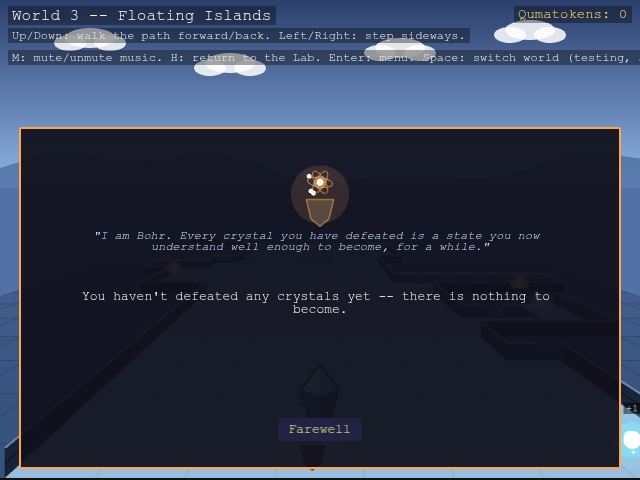
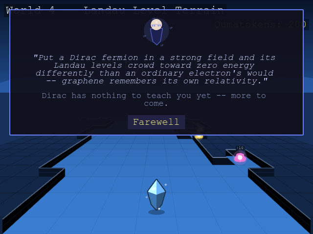
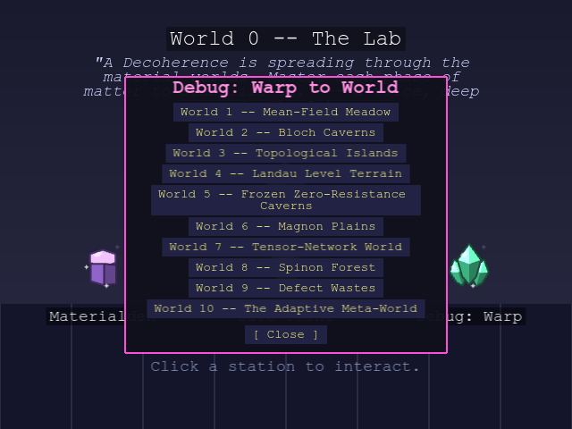

# World of Quantum Materials

A browser-based RPG with overworld exploration and turn-based battles, built
to teach the concepts from Aalto University's *Advanced Quantum Materials*
course a different way. Ten worlds, one per course topic -- walk around, get
ambushed by real compounds, answer a physics question mid-fight, and battle
your way to mastering every phase of matter.


## The premise

**You are a crystal yourself** -- the same kind of material the wild
encounters are drawn from, currently Silicon. A "Decoherence" is spreading through the material worlds, causing
them to lose their protected properties, and you're the one walking through
each phase of matter to stabilize it again.

## How it plays

**Explore.** Each world is a walkable corridor rendered in an
over-the-shoulder pseudo-3D view, the world redrawn from a smoothly moving
camera as you walk: Up/Down walk the path forward and back, Left/Right step
sideways. The corridor bends
as it climbs, so reaching the far end takes actually tracking the bend, not
just holding one direction. Short dead-end side paths branch off with a
qumatoken (the in-game currency) waiting at the end. Every world has its own
biome, matching that topic's flavor.

<table>
<tr>
<td></td>
<td></td>
</tr>
<tr>
<td></td>
<td></td>
</tr>
</table>

**Get ambushed.** Bump into a wild crystal and it starts a conversation, not
just a fight. Most ask a short physics question pulled straight from the
course material -- answer correctly and you go into battle with a power
boost, answer wrong and you're weakened, or just say "let me pass" and walk
on with no consequence either way.

<table>
<tr>
<td></td>
<td></td>
</tr>
<tr>
<td></td>
<td></td>
</tr>
</table>

**Battle.** Turn-based, speed-ordered by your crystal's Velocity stat. Every
move is a real quasiparticle -- Phonon Beam, Magnon Pulse, Anyon Braid,
Majorana Split -- and every material can only ever learn the moves its
actual physics supports (a plain band insulator never gets a magnon move,
since it has no magnetic order to carry one). Move power itself climbs with
how unconventional the quasiparticle is, from an ordinary Phonon Beam up to
a topological Anyon Braid or a non-Abelian Majorana Split. If a defender's
own physics can't host your move's quasiparticle at all, it lands at
**double damage** -- the one type-interaction rule in battle, kept
deliberately simple rather than a separate strong/weak chart on top of it.

<table>
<tr>
<td></td>
<td></td>
</tr>
<tr>
<td></td>
<td></td>
</tr>
</table>

**Grow.** Winning battles and grabbing qumatoken pickups funds the mentors
waiting partway through each world -- Noether sells new moves and sharper
stats, Bloch teleports you between worlds you've already visited, Bohr lets
you *transmute* into any crystal you've defeated, and mentors from Dirac
onward share the physics behind their own world's topic. Every mentor
you've met stays reachable from the Advisors panel, from anywhere.

<table>
<tr>
<td></td>
<td></td>
</tr>
<tr>
<td></td>
<td></td>
</tr>
</table>

**Face the boss.** Keep going past the mentor and you'll see it looming
before you even reach it: a gigantic, multi-shard boss crystal wrapped in
its own pulsing aura, standing at the far end of every world -- and it keeps
that same imposing look once the fight actually starts. Beating it is what
opens the way to the next world.

**Return to the Lab.** World 0 is a static hub room: a Save Point, and the
Materialdex, a running catalog of every crystal you've discovered with a
one-line note on the real physics behind it.

<table>
<tr>
<td></td>
<td></td>
</tr>
</table>

## The ten worlds

One world per course topic -- each with its own biome, wild-material
archetypes, and a rival crystal gating the way to the next world.

| # | World | Biome |
|---|---|---|
| 1 | Second quantization, mean-field, symmetry breaking | Mean-Field Meadow |
| 2 | Symmetries, tight-binding band structure | Bloch Caverns |
| 3 | Topological band theory | Topological Islands |
| 4 | Magnetic field, quantum Hall effect, Landau levels | Landau Level Terrain |
| 5 | Superconductivity, Nambu representation, Majoranas | Frozen Zero-Resistance Caverns |
| 6 | Classical magnetism and magnons | Magnon Plains |
| 7 | Quantum entanglement and tensor networks | Tensor-Network World |
| 8 | Quantum magnetism, spinons, Kondo physics | Spinon Forest |
| 9 | Excitations and defects | Defect Wastes |
| 10 | Machine learning for quantum materials | The Adaptive Meta-World |

World 10's wilds are "echoes" of earlier phases of matter rather than new
real compounds, and its rival is a final boss built as "a model of you,"
drawing from whatever moves you've collected by then.

## Controls

| Key | Action |
|---|---|
| Arrow keys | Move (Up/Down forward-back, Left/Right sideways) |
| Enter | Open the menu (moves, stats, advisors, tutorial, settings) |
| H | Return to the Lab (World 0) |
| M | Mute/unmute music |

## Settings

Open the Enter-key menu and click **Settings** to adjust:

- **Enemy Density** -- Low, Normal, High, or Very High, if wild crystals feel
  too sparse (or too frequent) along the path. Takes effect the next time you
  enter or re-enter a world.
- **Text Size** -- Compact, Normal, or Large. Applies immediately to every
  menu and dialogue in the game.


## Tutorial

Short tips appear one at a time, right as each feature comes up for the
first time -- entering the Lab, taking your first steps, your first wild
encounter, your first battle, your first qumatoken, your first mentor,
reaching your first goal -- instead of one long popup dumped on you up
front. Want the whole thing again as a refresher? Open the Enter-key menu
and click **Tutorial** to replay every tip in order.

## Debug Mode

Want to see a later world without grinding through the earlier ones? Toggle
**Debug Mode** on the title screen before starting. With it on:

- The Lab's door (and the Enter-menu's new **Warp** button, mid-run) opens a
  world-select list -- jump straight to any of the 10 worlds, in any order.
- Every time you enter a world, your stats, moves, and HP are automatically
  brought up to a level competitive with that world's opponents, so you're
  never stuck under-leveled just because you skipped ahead.



This is meant for exploring/testing the later worlds, not the intended way
to play through the story the first time.

## Playing it

The game isn't hosted yet -- to run it locally:

```
cd game
npm install
npm run dev
```

then open the local URL Vite prints (typically `http://localhost:5173`).

For build instructions, the project's file layout, and design/contribution
notes, see `DEVELOPMENT.md`.
