# World of Quantum Materials

A browser-based RPG with overworld exploration and turn-based battles, built
to teach the concepts from Aalto University's *Advanced Quantum Materials*
course a different way. Ten worlds, one per course topic -- walk around, get
ambushed by real compounds, answer a physics question mid-fight, and battle
your way to mastering every phase of matter.

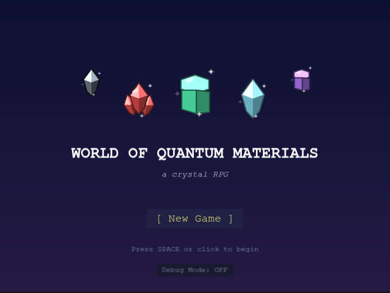

## The premise

**You are a crystal yourself** -- the same kind of material the wild
encounters are drawn from, starting out as Silicon. A "Decoherence" is spreading through the material worlds, causing
them to lose their protected properties, and you're the one walking through
each phase of matter to stabilize it again.

## How it plays

**Explore.** Each world is a walkable path rendered in an
over-the-shoulder pseudo-3D view, the world redrawn from a smoothly moving
camera as you walk: Up/Down walk forward and back, Left/Right step
sideways. Every world's own layout echoes its own physics, not just its
scenery -- a corridor that splits into two colored branches and remerges in
the mean-field world, a network of colored domains you trace the boundary
of in the topological world, a corridor that spirals around a frozen vortex
in the superconductivity world, a real ladder of linked lanes in the
tensor-network world, and so on -- so reaching the far end takes actually
reading that world's own shape, not just holding one direction. A handful of
qumatessence (the in-game currency) pickups are tucked along the way,
often at a dead end worth the detour. Every world has its own
biome, matching that topic's flavor -- and stepping off the path doesn't
always mean the same thing: the Floating Islands drop away into starlit open
space, the Frozen Caverns are a rippling frozen lake, and the Defect Wastes
are a glowing molten crust, alongside plainer rock everywhere else.

<table>
<tr>
<td>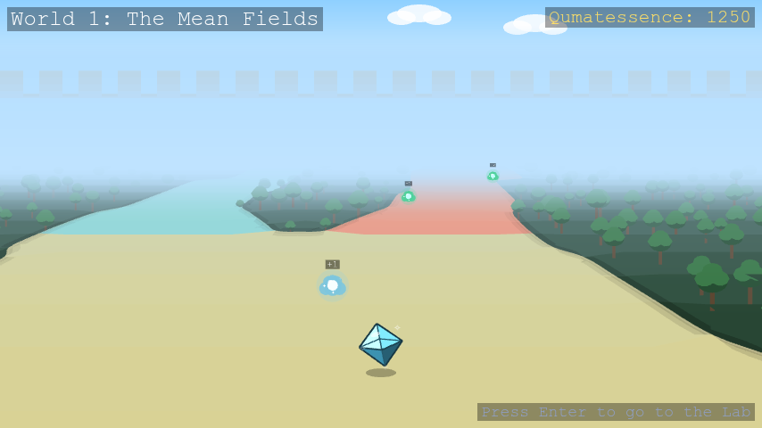</td>
<td>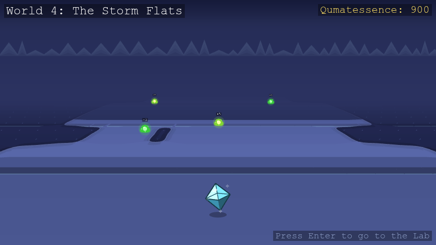</td>
</tr>
<tr>
<td>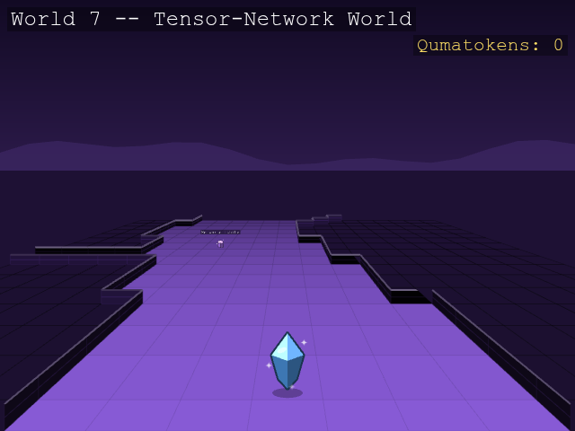</td>
<td>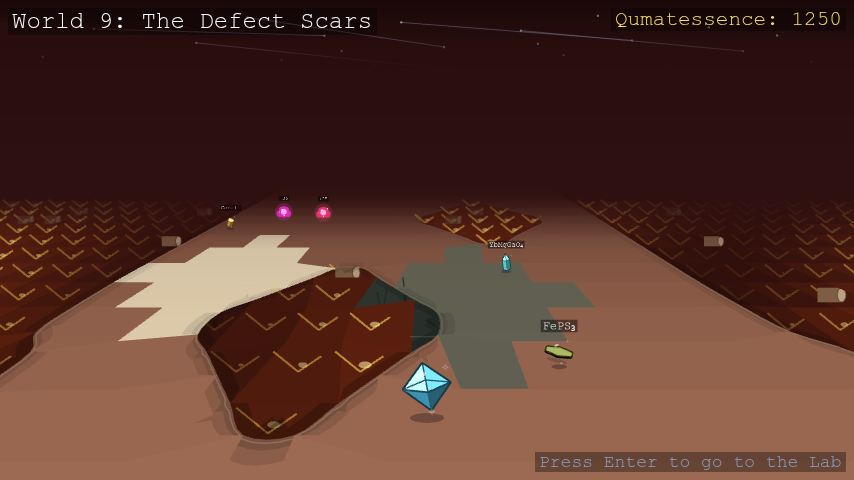</td>
</tr>
</table>

**Get ambushed.** Bump into a wild crystal and it starts a conversation, not
just a fight. Most ask a short physics question pulled straight from the
course material -- answer correctly and you go into battle with a power
boost, answer wrong and you're weakened, or just say "let me pass" and walk
on with no consequence either way. Every compound has its own look, too --
same main type, same base silhouette family, but each one gets its own tilt,
proportions, and tint, so a wild Chromium reads as its own crystal
standing next to the Nickel Oxide beside it.

<table>
<tr>
<td>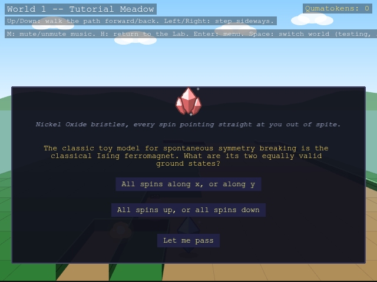</td>
<td>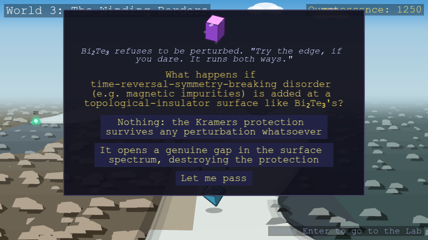</td>
</tr>
<tr>
<td>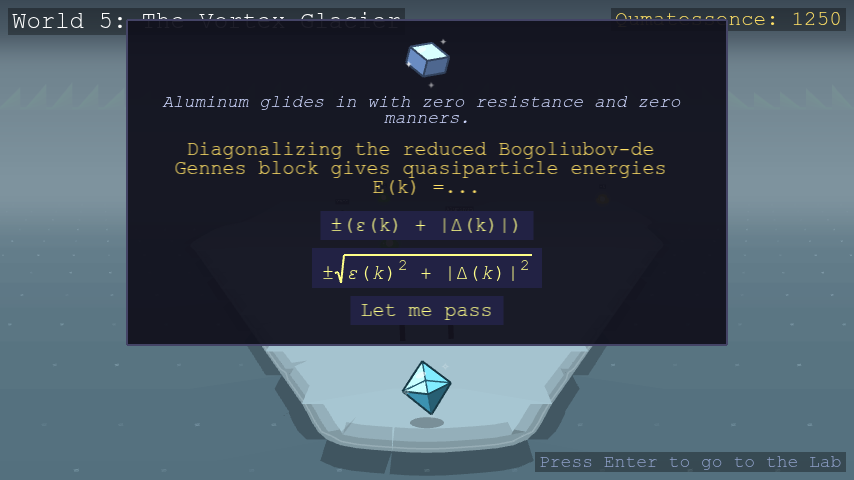</td>
<td>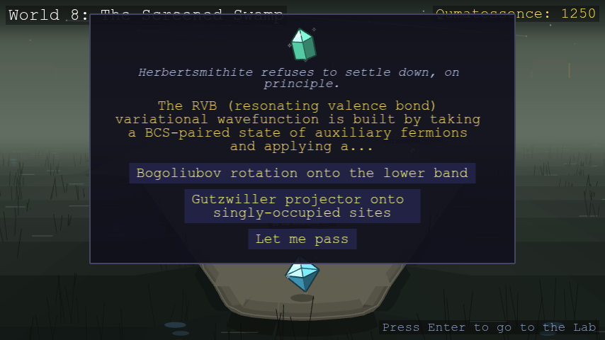</td>
</tr>
</table>

**Battle.** Turn-based, speed-ordered by your crystal's Velocity stat -- and
the faster side doesn't just go first, it swings more than once a round if
it's fast enough. Every move is a real quasiparticle, and every material can
only ever learn the
moves its actual physics supports -- a plain band insulator never gets a
magnon move, since it has no magnetic order to carry one. If a defender's
own physics can't host your move's quasiparticle at all, it lands at
**double damage**, the one type-interaction rule in battle. See
[Quasiparticles & moves](docs/quasiparticles.md) for the full move list and
which crystal types can use each one.

<table>
<tr>
<td>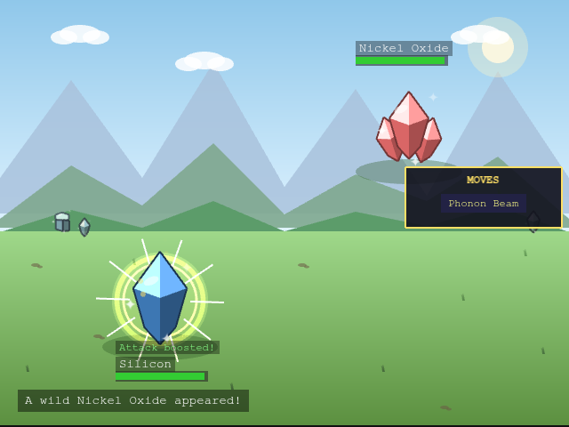</td>
<td>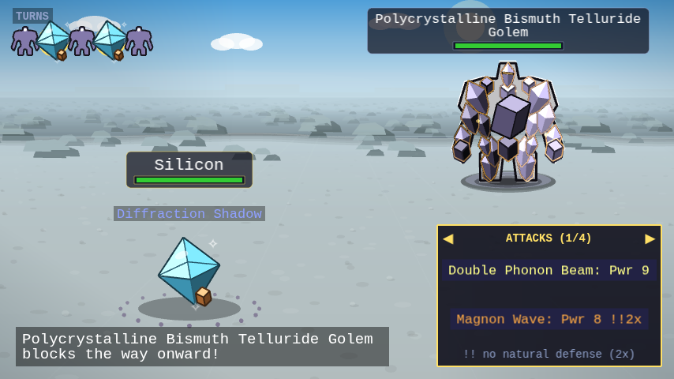</td>
</tr>
<tr>
<td></td>
<td>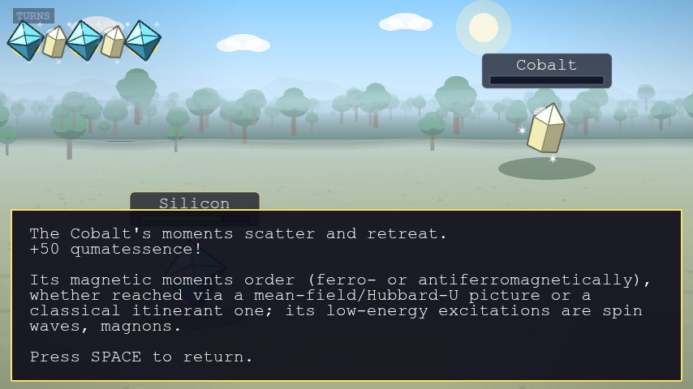</td>
</tr>
</table>

**Grow.** Winning battles and grabbing qumatessence pickups funds the guardians
waiting partway through each world -- ten of them in all, each teaching a
different way of bending the game's usual rules: new moves and stats,
teleportation, transmuting into a crystal you've defeated, always-on passive
abilities, fusing two crystals into a hybrid, quiz-gated power moves, and a
capstone quiz-gated ultimate move. Every guardian you've met stays reachable
from the Lab's Guardians station (which appears once you've met your first
one), and your current passive loadout is always checkable from its
Abilities station too (appears once you've learned your first passive). See
[Guardians](docs/guardians.md) for what each one does.

<table>
<tr>
<td>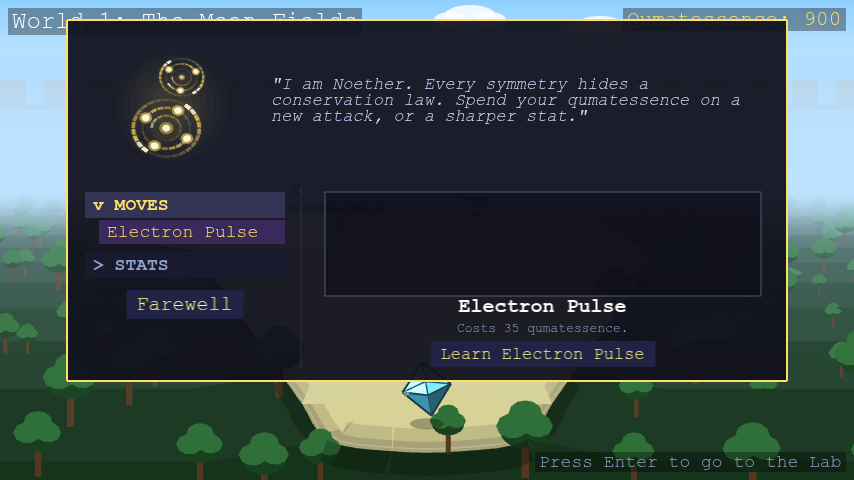</td>
<td>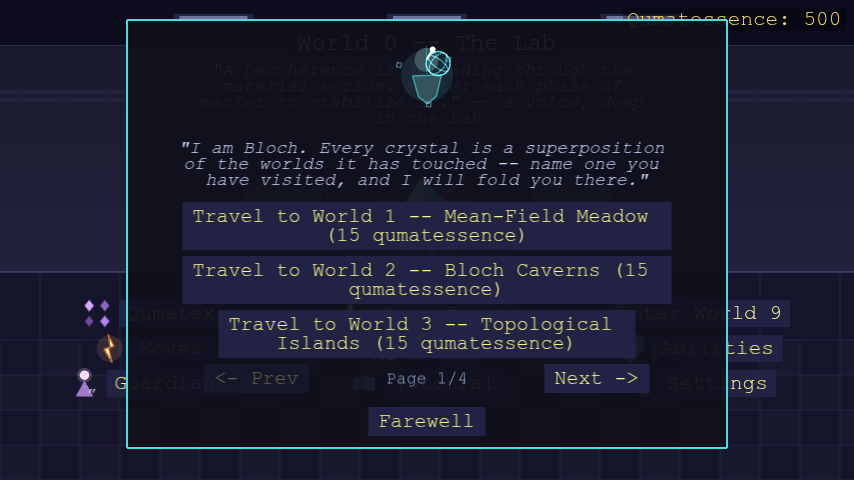</td>
</tr>
<tr>
<td>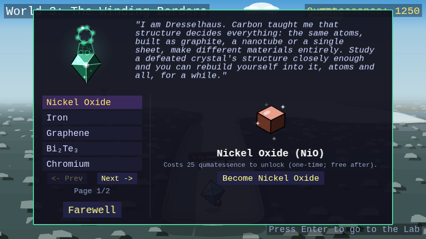</td>
<td>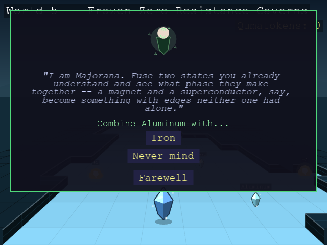</td>
</tr>
<tr>
<td>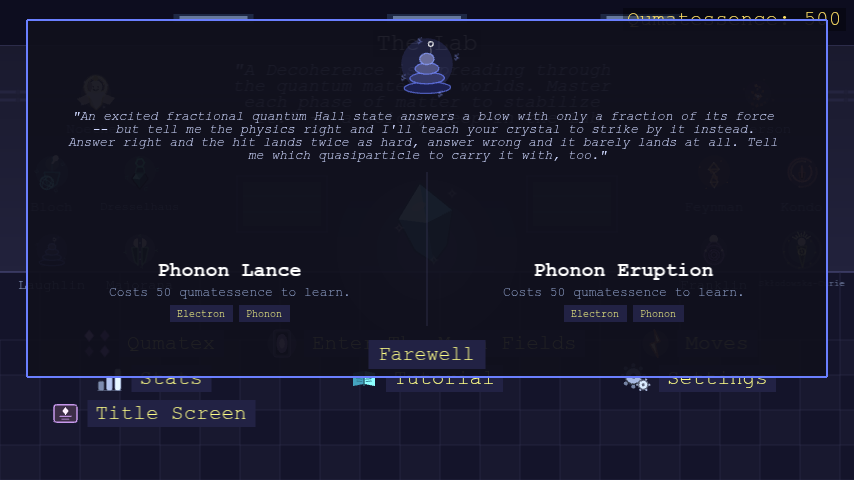</td>
<td>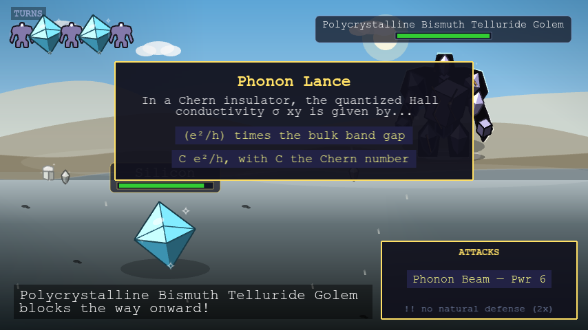</td>
</tr>
<tr>
<td>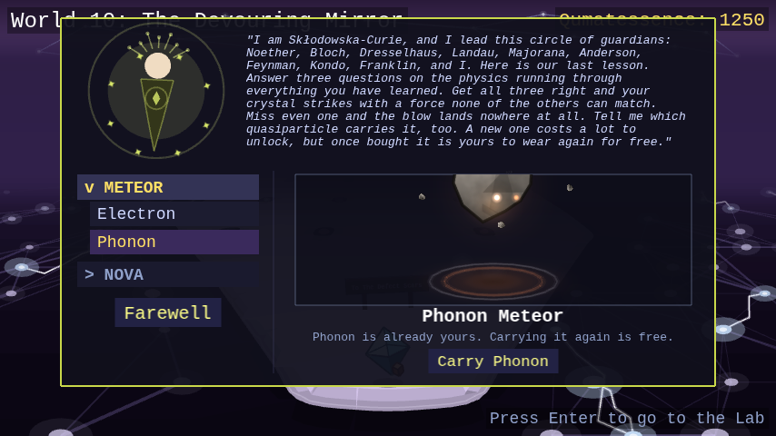</td>
<td>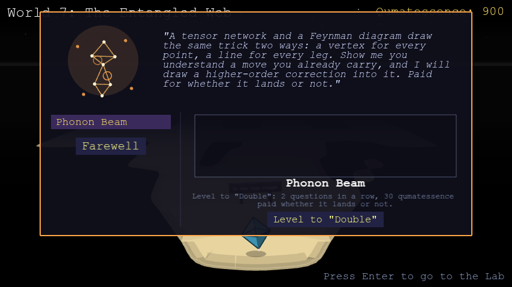</td>
</tr>
<tr>
<td>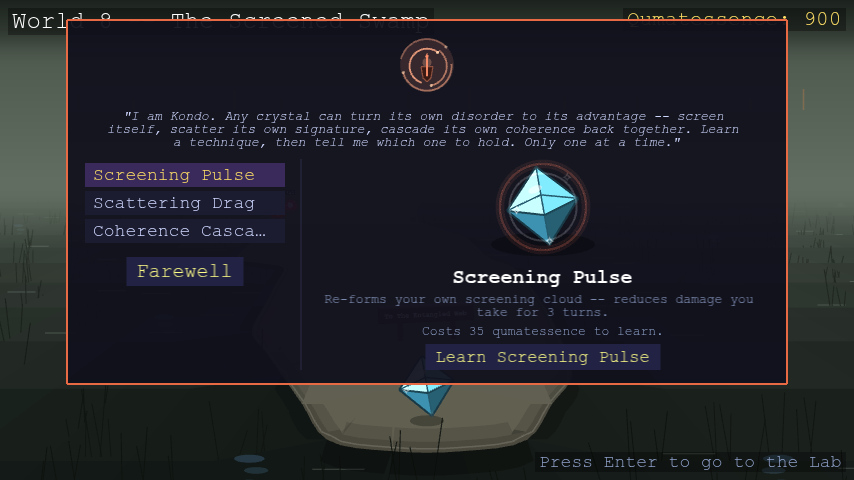</td>
</tr>
</table>

**Face the boss.** Keep going past the guardian and you'll see it looming
before you even reach it: a gigantic golem, built from many crystal shards
fused into one mass, its grain boundaries glowing where they meet and a
heavy shadow pooled under its feet, standing at the far end of every
world -- and it keeps that same imposing look once the fight starts. Its name is always a real compound in *polycrystalline*
form (many grains fused into one, the same idea the golem's own body
literalizes) -- Polycrystalline Silicon Golem guards World 1, for
instance. Beating it opens a glowing doorway right where the boss stood,
letting you walk straight on to the next world.

**Walk back anytime.** The near end of every world -- right where you first
walked in -- has its own doorway too, leading back to the world before it
(or the Lab, from World 1). Walk up to it and confirm to backtrack, no menu
required; you'll land back in that earlier world right at its own far end,
ready to walk forward through it again whenever you like.

**Return to the Lab.** World 0 is a static hub room, each of its jobs its
own physical station: Qumatex, a filterable index of every crystal in the
game listed by name alongside a note on the real physics behind it -- each
with a "???" placeholder name and silhouette for anything you haven't found
yet; a door back out to whichever world you're mid-way through; and stations
to check your moves, your stats, revisit any guardian you've met, replay the
tutorial, and adjust settings. Your progress autosaves as you play, so there's
no separate save button anywhere.

<table>
<tr>
<td>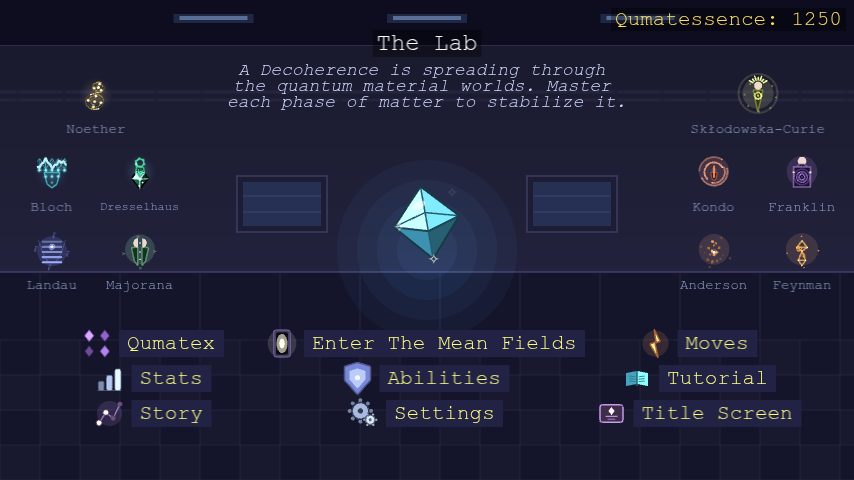</td>
<td>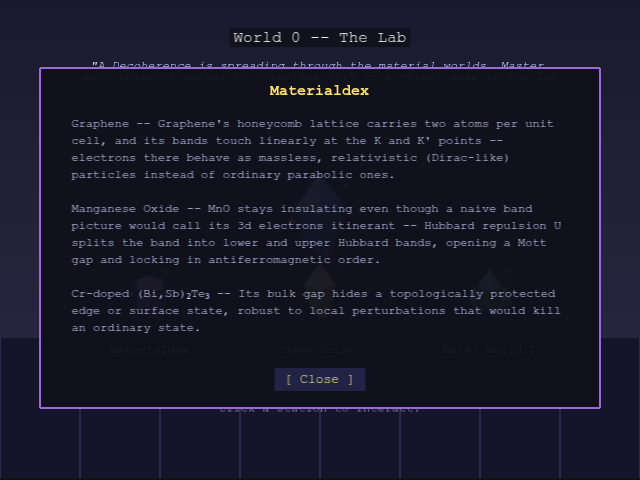</td>
</tr>
</table>

## The ten worlds

One world per course topic -- each with its own biome, wild-material
archetypes, and a rival crystal gating the way to the next world.

| # | World | Course topic |
|---|---|---|
| 1 | Mean-Field Meadow | Second quantization, mean-field, symmetry breaking |
| 2 | Bloch Caverns | Symmetries, tight-binding band structure |
| 3 | Topological Islands | Topological band theory |
| 4 | Landau Level Terrain | Magnetic field, quantum Hall effect, Landau levels |
| 5 | Frozen Zero-Resistance Caverns | Superconductivity, Nambu representation, Majoranas |
| 6 | Magnon Plains | Classical magnetism and magnons |
| 7 | Tensor-Network World | Quantum entanglement and tensor networks |
| 8 | Spinon Forest | Quantum magnetism, spinons, Kondo physics |
| 9 | Defect Wastes | Excitations and defects |
| 10 | The Adaptive Meta-World | Machine learning for quantum materials |

World 10's wilds are every hybrid crystal fusable at Majorana's station (see
[Hybrids](docs/hybrids.md)) — real compounds in their own right, just ones
reached by fusing two parents rather than found unmixed anywhere else. Its
rival, The Adapted, is a final boss built as "a model of you": it starts the
fight mirroring whichever type you're currently wearing, then reshapes
itself every time you land a hit, transmuting live into a real compound
that hosts whatever quasiparticle class you just attacked with. See
[Crystals](docs/crystals.md) for every world's full wild-material list.

## Battle basics

Turn order is speed-ordered by your crystal's Velocity stat: the faster side
swings first, and swings again -- up to 5 times a round -- the more its
Velocity outpaces the other side's, while the slower side always still gets
its own hit. Quantumness raises your crit ("coherent hit") chance,
Correlation raises your defense -- every stat runs from 1 up to a cap of 100,
raised one point at a time at Noether's shop.
Every crystal carries HP, fully healed after each battle -- qumatessence, not
HP attrition, are what's actually on the line from one fight to the next.
The move menu shows one kind of move at a time (ordinary attacks, quiz-gated
moves, or status-inflicting moves) rather than one flat list, with ◀/▶
arrows (or the Left/Right keys) to page between kinds when you have more
than one.

For the full mechanics -- every move and which crystals can use it, hybrid
materials, and what each guardian teaches -- see:

- [Quasiparticles & moves](docs/quasiparticles.md)
- [Crystals](docs/crystals.md)
- [Hybrid materials](docs/hybrids.md)
- [Guardians](docs/guardians.md)

## Controls

| Key | Action |
|---|---|
| Arrow keys | Move (Up/Down forward-back, Left/Right sideways) |
| Enter or H | Return to the Lab (World 0) |
| Enter, while in the Lab | Head back out to whichever world you're in the middle of (once you've entered one) |
| M | Mute/unmute music |

The Lab is where you check your moves and stats, revisit any guardian you've
met, replay the tutorial, and adjust settings -- each is its own station in
the room. Abilities and Guardians only show up once you've actually learned
a passive or met a guardian to check.

## Settings

In the Lab, click the **Settings** station to adjust:

- **Enemy Density** -- Low, Normal, High, or Very High, if wild crystals feel
  too sparse (or too frequent) along the path. Takes effect the next time you
  enter or re-enter a world.
- **Text Size** -- Compact, Normal, or Large. Applies immediately to every
  menu and dialogue in the game.
- **Music Style** -- Classic or Modern, two different arrangements of every
  world's soundtrack. Applies immediately.
- **Difficulty** -- B.Sc., M.Sc., or Ph.D., how hard every world's opponents
  hit. Unlike the settings above, meant to be changed mid-playthrough, not
  just once -- it applies to your very next battle.

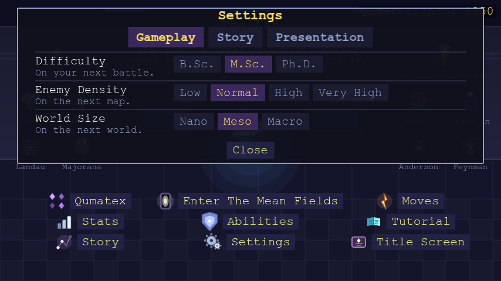

## Tutorial

Short tips appear one at a time, right as each feature comes up for the
first time -- entering the Lab, taking your first steps, your first wild
encounter, your first battle, your first qumatessence, your first guardian,
reaching your first goal. In the Lab, click **Tutorial** to reread any of
them, alongside a topic for every guardian's own ability (teleportation,
transmutation, quiz-gated moves, hybrid fusion, host doping, move leveling,
status effects, passives), the Settings station, and Story Mode vs.
Superposition Mode. Pick any topic on the left to read it on the right.

In Story Mode the list holds whatever you have found so far, in the order
you find it: a tip appears once it has been shown to you, and a guardian's
topic once you have met that guardian, so the page fills in as you play.
Superposition Mode lists every topic from the start, like everything else in
that mode.

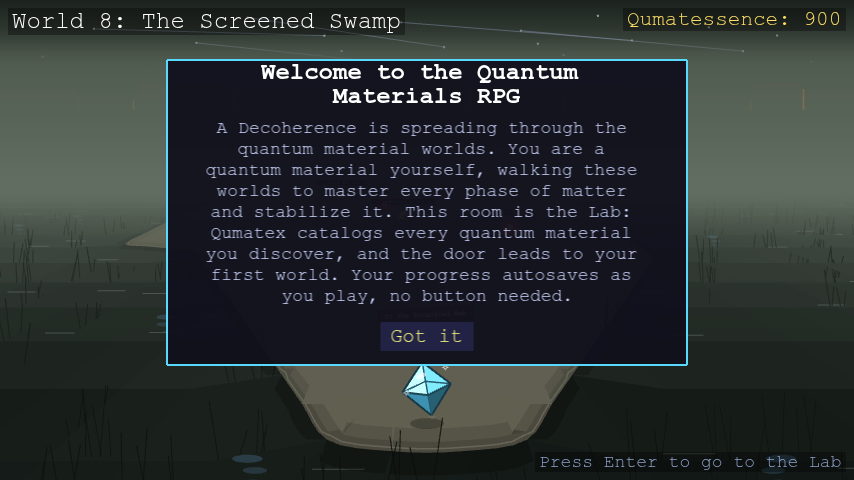

## Story Mode vs. Superposition Mode

Before you start, the title screen asks you to pick a mode:

- **Story Mode** is the normal playthrough -- start at World 1, defeat each
  world's rival to open the next one, meet each guardian in turn.
- **Superposition Mode** is for exploring/testing without grinding: every
  guardian is already met and everything they teach is unlocked from the
  moment you start -- even from the Lab, before you've stepped into any
  world. Every time you enter a world your stats, moves, and HP are
  automatically brought up to a level competitive with that world's
  opponents, Bloch's teleport hub (see above) offers every world immediately,
  and Dresselhaus/Majorana/Anderson offer every crystal in the game rather
  than only ones you've actually defeated. Kondo's active self-buff,
  Franklin's active passive, Anderson's doped-in impurity, and your own
  starting crystal (or hybrid, courtesy of Dresselhaus/Majorana) each start
  on a randomly chosen pick rather than a fixed default, so a fresh
  Superposition save rarely looks the same twice.


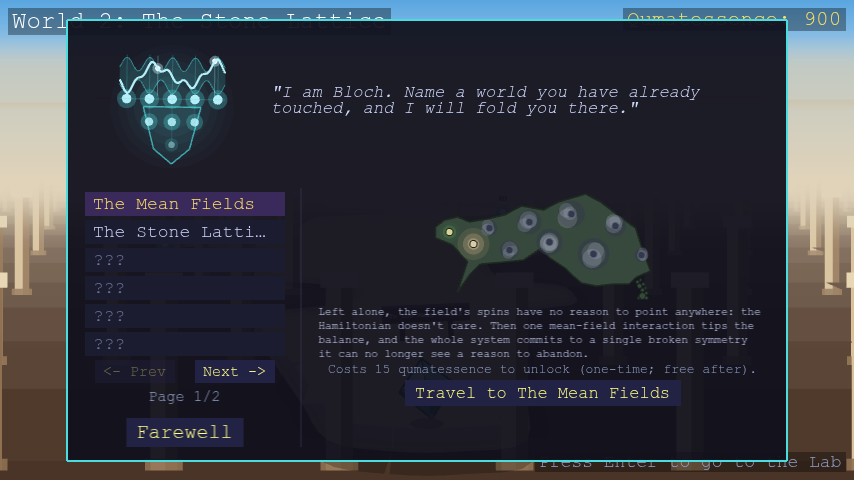

Superposition Mode isn't the intended way to play through the story the
first time -- it's there for seeing later worlds/guardians without earning
your way there first.

## Playing it

The game isn't hosted yet -- to run it locally, you need
[Node.js](https://nodejs.org) 18+ installed, then from the repo root:

```
npm run play
```

This installs dependencies on first run and opens the game in your browser.
It works the same way on Windows, macOS, and Linux.

For build instructions, the project's file layout, and design/contribution
notes, see `dev_notes/DEVELOPMENT.md`.
