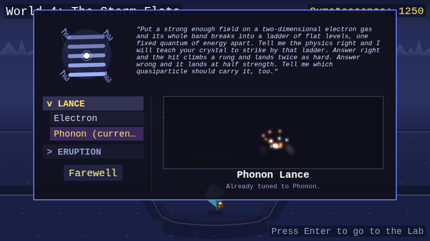

# World of Quantum Materials

**You are a quantum material.** A browser-based role-playing game that teaches
Aalto University's [*Advanced Quantum
Materials*](https://github.com/joselado/Advanced_Quantum_Materials_2025) course
from the inside: you start as Silicon, walk ten worlds (one per course topic),
and battle the real compounds that ambush you, using only the quasiparticles
your own lattice can host. Every move is a genuine excitation (magnons,
phonons, spinons, Majorana modes), and it lands at **double damage** on a
material whose physics cannot host it, so winning means knowing which phase you
are facing. Meanwhile a "Decoherence" is stripping the worlds of their
protected properties, and you are the one walking each phase of matter back
into shape.


## Play it

**In your browser**, nothing to install:

**https://joselado.github.io/world_of_quantum_materials/**

Works on any current browser on Windows, macOS or Linux. Needs no account, no
download and no permission to install software, so it runs on a locked-down
university machine as happily as on your own laptop. You need to be online to
open it.

**Offline, as a single file.** Download
[`game.html`](https://joselado.github.io/world_of_quantum_materials/game.html)
(right-click the link, "Save Link As...") and open it by double-clicking it.
The whole game is inside that one file, because every sprite and every note is
drawn and played by code rather than loaded from anywhere, so once it is on
your machine it never touches the network again.

**From the source**, if you want to read or change the game. Install
[Node.js](https://nodejs.org) 18+, then from the repo root:

```
npm run play
```

That installs what it needs on first run and opens the game. Same command on
Windows, macOS and Linux.

Your progress is saved in the browser you play in (or, for `game.html`, in the
browser you open it with), so it stays on that machine, and clearing your
browsing data clears it. There are no accounts and nothing is sent anywhere.

Build instructions, the project's file layout, and design/contribution notes
are in `dev_notes/DEVELOPMENT.md`.

## The premise

**You are a quantum material yourself**, the same kind of matter the wild
encounters are drawn from, starting out as Silicon. A "Decoherence" is
spreading through these worlds, causing them to lose their protected
properties, and you're the one walking through each phase of matter to
stabilize it again.

## How it plays

**Explore.** Each world is walkable ground rendered in an over-the-shoulder
pseudo-3D view, the world redrawn from a smoothly moving camera as you walk.
Every world's layout echoes its own physics, not just its scenery: a corridor
that splits into two colored branches and remerges in the mean-field world, an
open cloister you cross between rows of columns in the tight-binding world, a
network of colored domains you trace the boundary of in the topological world,
a spiral around a frozen vortex in the superconductivity world, a real ladder
of linked lanes in the entanglement world. Reaching the far end means reading
that shape, not just holding one direction. Pickups of qumatessence (the
in-game currency) are tucked along the way, often at a dead end worth the
detour, and a world you have picked clean quietly refills as you walk it,
always out of sight.

The ten worlds are one road, and the light dies along it, from morning through
storm and night to no sky at all, after which every world lights itself.
Stepping off the path is never safe, and what it costs you gets worse with
every world. From each world's far end you can see the next one on the horizon.

<table>
<tr>
<td></td>
<td></td>
</tr>
<tr>
<td></td>
<td></td>
</tr>
</table>

**Get ambushed.** Bump into a wild crystal and it starts a conversation, not
just a fight. Most ask a short physics question pulled straight from the course
material: answer correctly and you go into battle with a power boost, answer
wrong and you're weakened, or just say "let me pass" and walk on with no
consequence either way. Every compound has its own look too, drawn in the
crystal habit its real lattice grows in (a cubic compound is a blocky cube, a
monolayer a thin sheet floating over its own shadow), with its own tilt,
proportions and tint, so a wild Chromium reads as its own crystal standing next
to the Nickel Oxide beside it.

<table>
<tr>
<td></td>
<td></td>
</tr>
<tr>
<td></td>
<td></td>
</tr>
</table>

**Battle.** Turn-based, speed-ordered by your crystal's Momentum stat, and the
faster side doesn't just go first, it swings more than once a round if it's
fast enough. Every move is a real quasiparticle, and every material can only
ever learn the moves its actual physics supports: a plain band insulator never
gets a magnon move, since it has no magnetic order to carry one. If a defender's
own physics can't host your move's quasiparticle at all, it lands at
**double damage**, the one type-interaction rule in battle. See
[Quasiparticles & moves](docs/quasiparticles.md) for the full move list and
which crystal types can use each one.

<table>
<tr>
<td></td>
<td></td>
</tr>
<tr>
<td></td>
<td></td>
</tr>
</table>

**Grow.** Winning battles and grabbing qumatessence pickups funds the
guardians waiting partway through each world, ten in all, each teaching a
different way of bending the game's usual rules: new moves and stats,
teleportation, transmuting into a crystal you've defeated, always-on passive
abilities, fusing two crystals into a hybrid, quiz-gated power moves, and a
capstone quiz-gated ultimate move. Every guardian you've met then stands in the
Lab, one click away. See [Guardians](docs/guardians.md) for what each one does.

<table>
<tr>
<td></td>
<td></td>
</tr>
<tr>
<td></td>
<td></td>
</tr>
<tr>
<td></td>
<td></td>
</tr>
<tr>
<td></td>
<td></td>
</tr>
<tr>
<td></td>
</tr>
</table>

**Face the boss.** Every world narrows into a pass at its far end, and you
will see what stands in it long before you get there: a gigantic golem, built
from many crystal shards fused into one mass, filling the gap so completely
that nothing of the next world shows past it. Through World 9 its name is
always a real compound in *polycrystalline* form (many grains fused into one,
the same idea the golem's own body literalizes). Each one boasts about the very
property its own grains took from it, and none of them knows that is what it is
doing. World 10's rival, The Adapted,
is the one that breaks the pattern. Step to the mouth of the pass and press
Space to challenge it. Beat it and the pass clears: the next world's colours
show through the gap, a board names it, and pressing Space again crosses over.

**Walk back anytime.** The near end of every world, right where you first
walked in, is a pass too, with its own board and nobody guarding it, leading
back to the world before it (or the Lab, from World 1). Walk up and press,
no menu required; you'll land back in that earlier world right at its own far
end, ready to walk forward through it again whenever you like.

**Return to the Lab.** World 0 is a static hub room, each of its jobs its own
physical station: Qumatex, a filterable index of every crystal in the game
listed by name alongside a note on the real physics behind it, each with a
"???" placeholder name and silhouette for anything you haven't found yet; a
door back out to the furthest world you've reached; and stations to check your
moves, your stats, replay the tutorial, re-read the story so far, and adjust
settings. Every guardian you've met stands in the room itself, so you can click
one to reopen their panel without leaving. Your progress autosaves as you play,
so there's no separate save button anywhere.

<table>
<tr>
<td></td>
<td></td>
</tr>
</table>

## The ten worlds

One world per course topic, each with its own biome, wild-material
archetypes, and a rival crystal gating the way to the next world.

| # | World | Course topic |
|---|---|---|
| 1 | The Mean Fields | Second quantization, mean-field, symmetry breaking |
| 2 | The Stone Lattice | Symmetries, tight-binding band structure |
| 3 | The Winding Borders | Topological band theory |
| 4 | The Storm Flats | Magnetic field, quantum Hall effect, Landau levels |
| 5 | The Vortex Glacier | Superconductivity, Nambu representation, Majoranas |
| 6 | The Iron Steppe | Classical magnetism and magnons |
| 7 | The Entangled Web | Quantum entanglement and tensor networks |
| 8 | The Screened Swamp | Quantum magnetism, spinons, Kondo physics |
| 9 | The Defect Scars | Excitations and defects |
| 10 | The Devouring Mirror | Machine learning for quantum materials |

World 10's wilds are every hybrid crystal fusable at Majorana's station (see
[Hybrids](docs/hybrids.md)), real compounds in their own right, just ones
reached by fusing two parents rather than found unmixed anywhere else. Its
rival, The Adapted, is a final boss built as "a model of you": it starts the
fight mirroring whichever type you're currently wearing, then reshapes
itself every time you land a hit, transmuting live into a real compound
that hosts whatever quasiparticle class you just attacked with. See
[Crystals](docs/crystals.md) for every world's full wild-material list.

Each world has its own history, its own way the Decoherence comes for it,
and its own rival standing in the way, and the ten of them tell one story.
[The story](docs/storyline.md) is that story, world by world, from the
premise to the ending. **It spoils everything**, including who the final
enemy turns out to be, so it's for a second playthrough or for a player who
wants their bearings more than the surprise.

## Battle basics

Turn order runs on Momentum: the faster side swings first, and swings again
(up to 5 times a round) the more its Momentum outpaces the other side's, while
the slower side always still gets its own hit. Energy raises your crit
("coherent hit") chance and Lifetime raises your defense; every stat runs from
1 to a cap of 100, raised one point at a time at Noether's shop. HP is fully
healed after each battle, so qumatessence, not HP attrition, is what is
actually on the line from one fight to the next. The move menu shows one kind
of move at a time (ordinary attacks, quiz-gated moves, or status-inflicting
moves), with the Left/Right keys or the on-screen arrows to page between kinds.

For the full mechanics, meaning every move and which crystals can use it,
hybrid materials, and what each guardian teaches, see:

- [Quasiparticles & moves](docs/quasiparticles.md)
- [Crystals](docs/crystals.md)
- [Hybrid materials](docs/hybrids.md)
- [Guardians](docs/guardians.md)
- [The story](docs/storyline.md): spoils the whole plot, including the ending

All of it is also collected in **[the player's guide](guide.pdf)**, a single
printable document: this page, the story, and every reference table in one
place.

## Controls

Play uses both: the mouse chooses, the keyboard walks.

**With the mouse.** Everything on screen that offers something is clickable:
the Lab's stations and the guardians standing in the room, every panel button,
the prompt that appears at a pass, the answers to a wild crystal's question,
your moves in battle, and the arrows that page between kinds of move.

**With the keyboard.**

| Key | Action |
|---|---|
| Arrow keys | Walk (Up/Down forward and back, Left/Right sideways) |
| Space | Take whatever is offered where you stand: greet a wild crystal, challenge a rival, cross a pass, carry on after a battle |
| Enter or H | Return to the Lab (World 0) |
| Enter, while in the Lab | Head back out to whichever world you're in the middle of (once you've entered one) |
| Left / Right, in battle | Page between kinds of move |

Walking is the one thing the mouse can't do, and picking a move in battle or
opening a station in the Lab is the one thing the keyboard can't do.

The Lab is where everything else lives: your moves and stats, tutorial replays,
the story so far, and settings, each its own station in the room (see "Return
to the Lab" above).

## Settings

In the Lab, click the **Settings** station to adjust:

- **Enemy Density**: Low, Normal, High, or Very High, if wild crystals feel
  too sparse (or too frequent) along the path. Sets how many crystals a world
  holds at once, so it also governs how many drift back in after you have
  fought them. Takes effect the next time you enter or re-enter a world.
- **Text Size**: Compact, Normal, or Large. Applies immediately to every
  menu and dialogue in the game.
- **Music**: Classic or Modern, two different arrangements of every world's
  soundtrack, or Mute for no music at all. Sound effects keep playing either
  way. Applies immediately, and is remembered between sessions.
- **Difficulty**: B.Sc., M.Sc., or Ph.D., how hard every world's opponents
  hit. Unlike the settings above, meant to be changed mid-playthrough, not
  just once, and it applies to your very next battle.
- **World Size**: Nano, Meso, or Macro. Every world keeps its own shape and
  changes how big it is: Macro corridors run three times as wide and three
  times as far, Nano ones are a brisk run through the same place. Crystals and
  qumatessence are spread through it at the same rate either way, so a bigger
  world holds proportionally more of both. Takes effect the next time you enter
  a world.


## Tutorial

Short tips appear one at a time, right as each feature first comes up:
entering the Lab, your first steps, your first encounter, your first battle,
your first guardian. In the Lab, click **Tutorial** to reread any of them,
alongside a topic for every guardian's ability, the Settings station, and Story
Mode vs. Superposition Mode. In Story Mode the list fills in as you play; in
Superposition Mode every topic is listed from the start.


## Story Mode vs. Superposition Mode

Before you start, the title screen asks you to pick a mode:

- **Story Mode** is the normal playthrough: start at World 1, defeat each
  world's rival to open the next one, meet each guardian in turn.
- **Superposition Mode** is for players who want the whole game open from the
  first minute, with no story to work through first. Every guardian is already
  met and everything they teach is unlocked from the moment you start. Your
  stats, moves and HP are automatically brought up to each world's level,
  Bloch's teleport hub offers every world immediately, and Dresselhaus,
  Majorana and Anderson offer every crystal in the game. Several starting picks
  are randomized, so a fresh Superposition save rarely looks the same twice.


Pick Superposition Mode when you would rather browse than progress: to look at
a later world, try a guardian's ability, or see what a hybrid plays like,
without walking the road to it first. The two modes keep separate saves, so
you can keep a story run going and still go exploring whenever you feel like
it.
