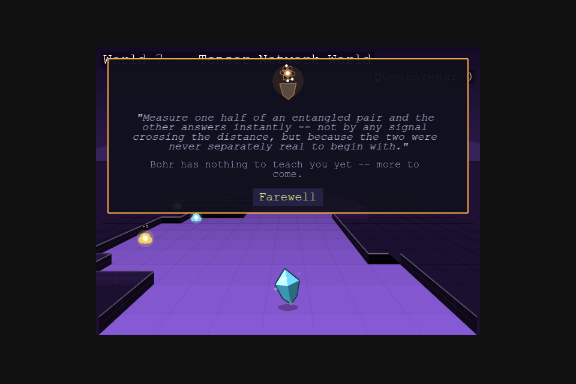

# World of Quantum Materials

A browser-based RPG with overworld exploration and turn-based battles, built
to teach the concepts from Aalto University's *Advanced Quantum Materials*
course a different way. Ten worlds, one per course topic -- walk around, get
ambushed by real compounds, answer a physics question mid-fight, and battle
your way to mastering every phase of matter.


## The premise

**You are a crystal yourself** -- the same kind of material the wild
encounters are drawn from, starting out as Silicon. A "Decoherence" is spreading through the material worlds, causing
them to lose their protected properties, and you're the one walking through
each phase of matter to stabilize it again.

## How it plays

**Explore.** Each world is a walkable corridor rendered in an
over-the-shoulder pseudo-3D view, the world redrawn from a smoothly moving
camera as you walk: Up/Down walk the path forward and back, Left/Right step
sideways. The corridor bends
as it climbs, so reaching the far end takes actually tracking the bend, not
just holding one direction. Short dead-end side paths branch off with a
qumatessence (the in-game currency) waiting at the end. Every world has its own
biome, matching that topic's flavor -- and stepping off the path doesn't
always mean a wall: the Floating Islands drop away into open sky, the Frozen
Caverns are a rippling frozen lake, and the Defect Wastes are a glowing
molten crust, alongside the more ordinary raised stone everywhere else.

<table>
<tr>
<td></td>
<td></td>
</tr>
<tr>
<td></td>
<td></td>
</tr>
</table>

**Get ambushed.** Bump into a wild crystal and it starts a conversation, not
just a fight. Most ask a short physics question pulled straight from the
course material -- answer correctly and you go into battle with a power
boost, answer wrong and you're weakened, or just say "let me pass" and walk
on with no consequence either way. Every compound has its own look, too --
same main type, same base silhouette family, but each one gets its own tilt,
proportions, and tint, so a wild Manganese Oxide reads as its own crystal
standing next to the Nickel Oxide beside it.

<table>
<tr>
<td></td>
<td></td>
</tr>
<tr>
<td></td>
<td></td>
</tr>
</table>

**Battle.** Turn-based, speed-ordered by your crystal's Velocity stat -- and
the faster side doesn't just go first, it swings more than once a round if
it's fast enough. Every move is a real quasiparticle, and every material can
only ever learn the
moves its actual physics supports -- a plain band insulator never gets a
magnon move, since it has no magnetic order to carry one. If a defender's
own physics can't host your move's quasiparticle at all, it lands at
**double damage**, the one type-interaction rule in battle. See
[Quasiparticles & moves](docs/quasiparticles.md) for the full move list and
which crystal types can use each one.

<table>
<tr>
<td></td>
<td></td>
</tr>
<tr>
<td></td>
<td></td>
</tr>
</table>

**Grow.** Winning battles and grabbing qumatessence pickups funds the guardians
waiting partway through each world -- ten of them in all, each teaching a
different way of bending the game's usual rules: new moves and stats,
teleportation, transmuting into a crystal you've defeated, always-on passive
abilities, fusing two crystals into a hybrid, quiz-gated power moves, and a
capstone quiz-gated ultimate move. Every guardian you've met stays reachable
from the Guardians panel,
from anywhere, and your current passive loadout is always checkable from the
Enter-menu's "View Abilities" panel too. See [Guardians](docs/guardians.md)
for what each one does.

<table>
<tr>
<td></td>
<td></td>
</tr>
<tr>
<td></td>
<td></td>
</tr>
<tr>
<td></td>
<td></td>
</tr>
<tr>
<td></td>
<td></td>
</tr>
<tr>
<td></td>
</tr>
</table>

**Face the boss.** Keep going past the guardian and you'll see it looming
before you even reach it: a gigantic golem, built from many crystal shards
fused into one mass and wrapped in its own pulsing aura, standing at the
far end of every world -- and it keeps that same imposing look once the
fight starts. Its name is always a real compound in *polycrystalline*
form (many grains fused into one, the same idea the golem's own body
literalizes) -- Polycrystalline Silicon Golem guards World 1, for
instance. Beating it opens a glowing doorway right where the boss stood,
letting you walk straight on to the next world.

**Walk back anytime.** The near end of every world -- right where you first
walked in -- has its own doorway too, leading back to the world before it
(or the Lab, from World 1). Walk up to it and confirm to backtrack, no menu
required; you'll land back in that earlier world right at its own far end,
ready to walk forward through it again whenever you like.

**Return to the Lab.** World 0 is a static hub room: a Save Point, and the
Materialdex, a filterable index of every crystal in the game listed by name
alongside a note on the real physics behind it -- each with a "???"
placeholder name and silhouette for anything you haven't found yet.

<table>
<tr>
<td></td>
<td></td>
</tr>
</table>

## The ten worlds

One world per course topic -- each with its own biome, wild-material
archetypes, and a rival crystal gating the way to the next world.

| # | World | Biome |
|---|---|---|
| 1 | Second quantization, mean-field, symmetry breaking | Mean-Field Meadow |
| 2 | Symmetries, tight-binding band structure | Bloch Caverns |
| 3 | Topological band theory | Topological Islands |
| 4 | Magnetic field, quantum Hall effect, Landau levels | Landau Level Terrain |
| 5 | Superconductivity, Nambu representation, Majoranas | Frozen Zero-Resistance Caverns |
| 6 | Classical magnetism and magnons | Magnon Plains |
| 7 | Quantum entanglement and tensor networks | Tensor-Network World |
| 8 | Quantum magnetism, spinons, Kondo physics | Spinon Forest |
| 9 | Excitations and defects | Defect Wastes |
| 10 | Machine learning for quantum materials | The Adaptive Meta-World |

World 10's wilds are "echoes" of earlier phases of matter rather than new
real compounds, and its rival is a final boss built as "a model of you,"
drawing from whatever moves you've collected by then. See
[Crystals](docs/crystals.md) for every world's full wild-material list.

## Battle basics

Turn order is speed-ordered by your crystal's Velocity stat: the faster side
swings first, and swings again -- up to 3 times a round -- the more its
Velocity outpaces the other side's, while the slower side always still gets
its own hit. Quantumness raises your crit ("coherent hit") chance,
Correlation raises your defense.
Every crystal carries HP, fully healed after each battle -- qumatessence, not
HP attrition, are what's actually on the line from one fight to the next.
The move menu shows one kind of move at a time (ordinary attacks, quiz-gated
moves, or status-inflicting moves) rather than one flat list, with ◀/▶
arrows (or the Left/Right keys) to page between kinds when you have more
than one.

For the full mechanics -- every move and which crystals can use it, hybrid
materials, and what each guardian teaches -- see:

- [Quasiparticles & moves](docs/quasiparticles.md)
- [Crystals](docs/crystals.md)
- [Hybrid materials](docs/hybrids.md)
- [Guardians](docs/guardians.md)

## Controls

| Key | Action |
|---|---|
| Arrow keys | Move (Up/Down forward-back, Left/Right sideways) |
| Enter | Open the menu (moves, stats, guardians, tutorial, settings) |
| H | Return to the Lab (World 0) |
| M | Mute/unmute music |

## Settings

Open the Enter-key menu and click **Settings** to adjust:

- **Enemy Density** -- Low, Normal, High, or Very High, if wild crystals feel
  too sparse (or too frequent) along the path. Takes effect the next time you
  enter or re-enter a world.
- **Text Size** -- Compact, Normal, or Large. Applies immediately to every
  menu and dialogue in the game.
- **Music Style** -- Classic or Modern, two different arrangements of every
  world's soundtrack. Applies immediately.


## Tutorial

Short tips appear one at a time, right as each feature comes up for the
first time -- entering the Lab, taking your first steps, your first wild
encounter, your first battle, your first qumatessence, your first guardian,
reaching your first goal. Want the whole thing again as a refresher? Open the Enter-key menu
and click **Tutorial** to replay every tip in order.

## Story Mode vs. Superposition Mode

Before you start, the title screen asks you to pick a mode:

- **Story Mode** is the normal playthrough -- start at World 1, defeat each
  world's rival to open the next one, meet each guardian in turn.
- **Superposition Mode** is for exploring/testing without grinding: every
  time you enter a world your stats, moves, and HP are automatically brought
  up to a level competitive with that world's opponents, every world is
  already marked visited so Bloch's teleport hub (see above) can fold you to
  any of them immediately, and Dresselhaus/Majorana/Anderson offer every crystal in
  the game rather than only ones you've actually defeated.


Superposition Mode isn't the intended way to play through the story the
first time -- it's there for seeing later worlds/guardians without earning
your way there first.

## Playing it

The game isn't hosted yet -- to run it locally:

```
cd game
npm install
npm run dev
```

then open the local URL Vite prints (typically `http://localhost:5173`).

For build instructions, the project's file layout, and design/contribution
notes, see `DEVELOPMENT.md`.
