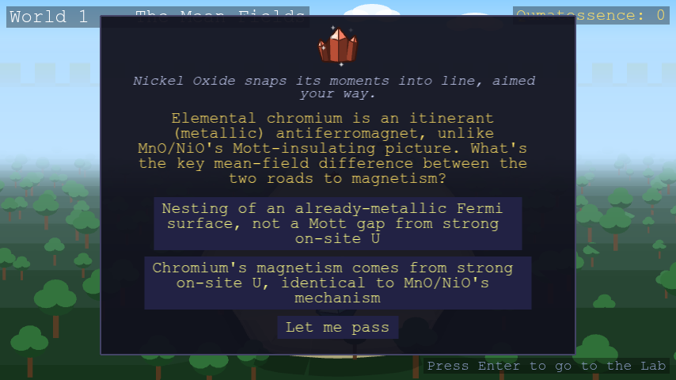

# Crystals

Every wild encounter is named after a real compound (or, for World 10's
heterostructures, a credibly engineered one) rather than a generic
monster. A crystal's type fixes its look and which quasiparticles it can
host (see [Quasiparticles & moves](quasiparticles.md)). Each world draws
from its own course topic, though a few compounds show up in more than one
world when the same real material is relevant to both. World 9 is the
exception: alongside its own defect compounds listed below, every
non-hybrid crystal from Worlds 1-8 turns up there too, so any type can
appear.

<!-- GENERATED:WORLDS START -->
### World 1: Second quantization, mean-field, symmetry breaking

| Crystal | Type |
| --- | --- |
| Barium Titanate | Ferroelectric |
| Potassium Dihydrogen Phosphate | Ferroelectric |
| Europium Oxide | Insulating Magnet |
| Manganese Fluoride | Insulating Magnet |
| Nickel Oxide | Insulating Magnet |
| Graphene | Metal |
| Titanium Diselenide | Metal |
| Chromium | Metallic Magnet |
| Cobalt | Metallic Magnet |
| Iron | Metallic Magnet |
| Aluminum | Superconductor |

### World 2: Symmetries, tight-binding band structure

| Crystal | Type |
| --- | --- |
| Diamond | Insulator |
| Magnesium Oxide | Insulator |
| Monolayer Boron Nitride | Insulator |
| Graphene | Metal |
| HgTe | Metal |
| Silver | Metal |
| Tungsten | Metal |
| CdTe | Semiconductor |
| Gallium Nitride | Semiconductor |
| Indium Arsenide | Semiconductor |
| Monolayer MoTe₂ (2H) | Semiconductor |
| Phosphorene | Semiconductor |

### World 3: Topological band theory

| Crystal | Type |
| --- | --- |
| Bi₂Te₃ | Quantum Spin Hall Insulator |
| Bismuthene | Quantum Spin Hall Insulator |
| Jacutingaite | Quantum Spin Hall Insulator |
| Monolayer WTe₂ | Quantum Spin Hall Insulator |

### World 4: Integer and fractional quantum Hall effect

| Crystal | Type |
| --- | --- |
| MnBi₂Te₄ | Chern Insulator |
| Graphene | Metal |
| Gallium Arsenide | Semiconductor |

### World 5: Superconductivity, Nambu representation, Majoranas

| Crystal | Type |
| --- | --- |
| Uranium Ditelluride | Chern Superconductor |
| Aluminum | Superconductor |
| Lanthanum Decahydride | Superconductor |
| Lead | Superconductor |
| Niobium | Superconductor |
| Tantalum Disulfide (1H) | Superconductor |
| YBCO | Superconductor |

### World 6: Classical magnetism and magnons

| Crystal | Type |
| --- | --- |
| Chromium Tribromide | Insulating Magnet |
| Chromium Triiodide | Insulating Magnet |
| FePS₃ | Insulating Magnet |
| Manganese Oxide | Insulating Magnet |
| Yttrium Iron Garnet | Insulating Magnet |
| Cobalt | Metallic Magnet |
| Fe₃GeTe₂ | Metallic Magnet |
| Iron | Metallic Magnet |
| Bismuth Ferrite | Multiferroic |
| Monolayer NiI₂ | Multiferroic |

### World 7: Quantum entanglement and tensor networks

| Crystal | Type |
| --- | --- |
| Herbertsmithite | Quantum Spin Liquid |
| Strontium Copper Borate | Quantum Spin Liquid |
| Thallium Copper Chloride | Quantum Spin Liquid |
| Y₂BaNiO₅ | Quantum Spin Liquid |

### World 8: Quantum magnetism, spinons, Kondo physics

| Crystal | Type |
| --- | --- |
| Cerium Cobalt Indide | Kondo Heavy Fermion |
| YbRh₂Si₂ | Kondo Heavy Fermion |
| Cerium Zirconate Pyrochlore | Quantum Spin Liquid |
| Herbertsmithite | Quantum Spin Liquid |
| Tantalum Disulfide (1T) | Quantum Spin Liquid |
| YbMgGaO₄ | Quantum Spin Liquid |
| α-Ruthenium Trichloride | Quantum Spin Liquid |

### World 9: Excitations and defects

| Crystal | Type |
| --- | --- |
| Fe(Te,Se) | Chern Superconductor |
| Barium Titanate | Ferroelectric |
| GeTe | Ferroelectric |
| Hafnium Oxide | Ferroelectric |
| Monolayer SnTe | Ferroelectric |
| Fe₃GeTe₂ | Metallic Magnet |
| Manganese | Metallic Magnet |
| Niobium Diselenide | Superconductor |

### World 10: Machine learning for quantum materials

| Crystal | Type |
| --- | --- |
| Cr-doped (Bi,Sb)₂Te₃ | Chern Insulator |
| CrI₃/NbSe₂ Topological-SC Heterostructure | Chern Superconductor |
| Fe/Pb Majorana Chain | Chern Superconductor |
| InAs/Al Majorana Wire | Chern Superconductor |
| NbSe₂/CrBr₃ Topological-SC Heterostructure | Chern Superconductor |
| Rhombohedral Pentalayer Graphene/hBN Moiré | Fractional Chern Insulator |
| Twisted Bilayer MoTe₂ | Fractional Chern Insulator |
| 1T/1H-TaS₂ Heterostructure | Kondo Heavy Fermion |
| Twisted CrI₃ | Multiferroic |
| HgTe/CdTe Quantum Well | Quantum Spin Hall Insulator |
| Twisted Bilayer Graphene | Superconductor |
<!-- GENERATED:WORLDS END -->

## World rivals

Each world's rival is the one encounter that actually gates progress: beat
it, and the way to the next world opens.

World 9 and World 10's rivals are both missing from the table below, because neither
has a fixed type.

World 9's rival is a golem like the others, but the Defect Scars are patched
together from every world before them, so which compound it is, and with it
its type, is rolled at random every time you reach World 9, and stays fixed
only for that visit. It fights with that compound's own signature
quasiparticle, decohered like every golem's, plus Phonon Beam.
Check the boss preview on the goal tile before you commit to a form.

World 10's rival, The Adapted, is "a model of you": it starts the fight
mirroring whichever type you're currently wearing, then reshapes itself
every time you land a hit, always taking on the type and look of a real
compound that hosts whatever quasiparticle class you just attacked with, so
repeating the same attack loses its edge, while varying your moves keeps it
guessing. The battle log names the compound it has just become, but The
Adapted keeps its own name through every form. Every other rival is named
for a real compound's *polycrystalline* form: many crystal grains fused into
one mass, rendered as an actual golem built from fused shards.

<!-- GENERATED:RIVALS_TABLE START -->
| World | Rival | Type |
| --- | --- | --- |
| 1 | Polycrystalline Silicon Golem | Semiconductor |
| 2 | Polycrystalline Silica Golem | Insulator |
| 3 | Polycrystalline Bismuth Telluride Golem | Quantum Spin Hall Insulator |
| 4 | Polycrystalline Manganese Bismuth Telluride Golem | Chern Insulator |
| 5 | Polycrystalline YBCO Golem | Superconductor |
| 6 | Polycrystalline Iron Golem | Metallic Magnet |
| 7 | Polycrystalline Herbertsmithite Golem | Quantum Spin Liquid |
| 8 | Polycrystalline Ruthenium Trichloride Golem | Quantum Spin Liquid |
<!-- GENERATED:RIVALS_TABLE END -->

See [Hybrids](hybrids.md) for the fused materials that sit alongside these,
and [Guardians](guardians.md) for how Dresselhaus, Majorana, and Anderson
each let you borrow another crystal's physics.
