# Guardians

One guardian waits partway through each of the ten worlds, each teaching you
a different way to bend the game's usual rules. Every guardian you've met
then stands in the Lab, five along each upper corner, running anticlockwise
around the room from Noether at the top left to Skłodowska-Curie at the top
right, with their slot staying empty until you've met them. Clicking one opens
their shop or panel right there, no travel required. Hover a figure to see their
full name and what they teach. Bloch's own panel is the
exception with a purpose: fast travel is literally what he offers, so his
destination list is where a warp actually happens.

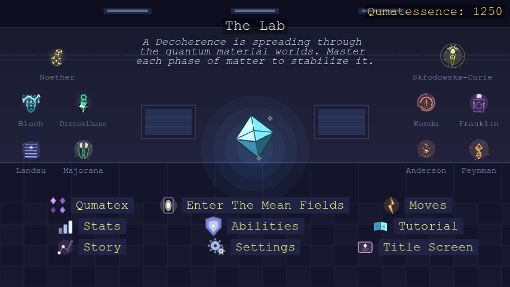

| Guardian | World | What they do |
|---|---|---|
| [Noether's Currents](#noethers-currents) | 1 | Sells ordinary moves and stat upgrades |
| [Bloch's States](#blochs-states) | 2 | Teleports you between worlds you've visited |
| [Dresselhaus's Nanostructures](#dresselhauss-nanostructures) | 3 | Lets you transmute into a defeated crystal |
| [Landau's Formulas](#landaus-formulas) | 4 | Sells two quiz-gated Analytic moves |
| [Majorana's Fusion](#majoranas-fusion) | 5 | Fuses two crystals into a hybrid state |
| [Anderson's Impurities](#andersons-impurities) | 6 | Lets you dope in an impurity move |
| [Feynman's Diagrammatics](#feynmans-diagrammatics) | 7 | Lets you level up a move you already know |
| [Kondo's Clouds](#kondos-clouds) | 8 | Sells self-buff moves |
| [Franklin's Scatterings](#franklins-scatterings) | 9 | Teaches always-on passive abilities |
| [Skłodowska-Curie's Experiments](#skłodowska-curies-experiments) | 10 | Teaches two quiz-gated Ultimate moves |

## Noether's Currents

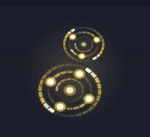

Sells every ordinary attack move and stat upgrade in the game, priced by raw
power. Her shop only shows what your *current* crystal form can actually
use, as a semiconductor-type player (Silicon, by default), you'll only see
Electron Pulse until you transmute into a form whose physics supports more
(see [Quasiparticles & moves](quasiparticles.md)).

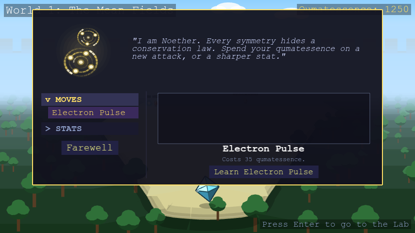

## Bloch's States

Fast travel between worlds: Bloch teleports you to any world you've already
visited, so backtracking never means re-walking a whole corridor.

- First trip to a given world: 15 qumatessence
- Every later trip to that same world: free
- Each world you haven't unlocked yet is priced separately, there's no
  single purchase that opens every destination at once

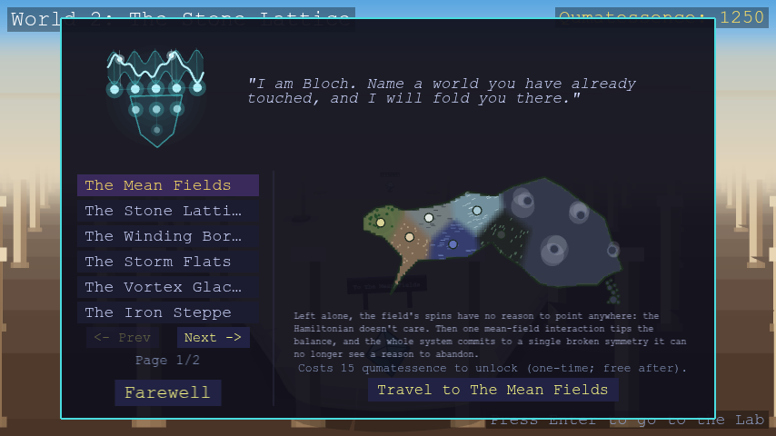

## Dresselhaus's Nanostructures

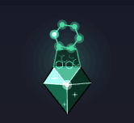

Lets you *transmute* into any crystal you've already defeated, your look
and which of your moves are usable both switch over, your stats stay yours,
and nothing you've already learned is erased. Switch back later and you get
the rest of it back for free.

The idea: the same atoms, built into a different nanostructure, become a
different material entirely, so understanding a defeated crystal well
enough lets you rebuild yourself into it, for a while. Only works on
standalone crystals, never a [hybrid](hybrids.md).

- First time becoming a given crystal: 25 qumatessence
- Every later transmutation back into that same crystal: free

## Landau's Formulas

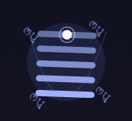

Sells two quiz-gated Analytic moves. Each one asks a physics-equation
question before it lands: answer right and it hits for double damage, answer
wrong and it's halved, with a flashier effect than an ordinary move.
The question pool only draws from worlds you've already visited, so early on
you'll only be asked things you could plausibly already know.

Buying (or later revisiting Landau) also lets you pick which quasiparticle
the move should carry, filtered to whatever your *current* form can host.
The move stays usable from any form and always asks its question, but this
choice decides whether it can land a quasiparticle-mismatch hit like an
ordinary attack. Transmute into a form that can't host your picked
quasiparticle, and the move falls back to its Phonon form (the one class
every form hosts) for as long as you wear that form. Your pick is kept:
transmute back into a form that can host it and the move carries it again,
free and without retuning.

## Majorana's Fusion

Lets you fuse two crystals you've already defeated into a brand-new hybrid
state and become it, if the pairing matches one of the game's named recipes
(see [Hybrids](hybrids.md)), rendered as an actual mix of both parents' own
colors and shapes. Browse hybrids directly by their result: pick one from the
list to preview its two component crystals, the fused result, and its own
physics blurb before deciding.

- Browsing any hybrid: always free
- First time fusing into a given hybrid result: 60 qumatessence
- Every later fusion into that same result: free, however you reach it

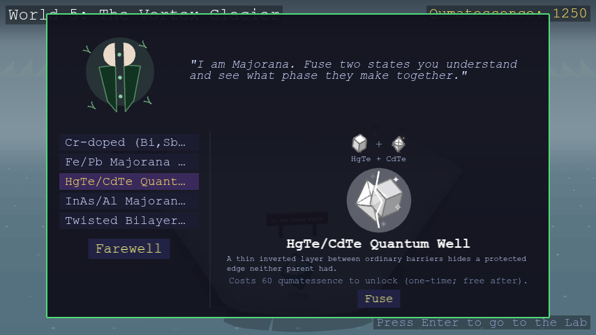

## Anderson's Impurities

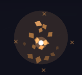

Lets you "dope in" a crystal you've defeated as an impurity and learn one
specific move from it, borrowing a single excitation channel without fully
becoming that crystal the way Dresselhaus does. The move keeps firing in
battle for as long as you stay doped with that crystal, even if your own
current form can't otherwise host it. Dope in a different crystal later and
you lose whichever channels only the old one gave you. Only original,
standalone crystals work as hosts, never a [hybrid](hybrids.md).

- Browsing which crystal to dope in: always free
- First time learning a move from a given host: 35 qumatessence
- Every later visit to that same host (learning any of its moves, then or
  later): free

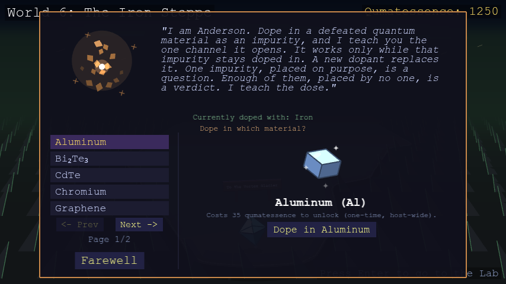

## Feynman's Diagrammatics

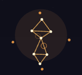

Lets you level up any move you already know how to use, no matter which
guardian originally taught it to you. Three tiers sit on top of a move's
base form (Double, Triple, and Infinite), each one a bigger boost (1.5x,
then 2x, then 3x) and its own name prefix ("Electron Pulse" becomes
"Double Electron Pulse," then "Triple Electron Pulse," then "Infinite
Electron Pulse"). For an ordinary attack, that boost multiplies its power;
for one of Kondo's three self-buffs, it strengthens the buff itself instead
(see [Kondo's Clouds](#kondos-clouds) below). You can only attempt the next
tier once you've already landed the one before it.

Leveling a move is a gamble, not a straightforward purchase: you pay the
qumatessence up front, then have to answer a streak of physics questions in
a row, 2 correct in a row for Double, 4 for Triple, 8 for Infinite. Answer
every one right and the move levels up for good. Miss even a single
question and the move stays at its current level, the qumatessence you
paid is gone either way, there's no refund on a miss. The cost to attempt a
tier scales with the move's own power and how deep a tier you're
attempting, so a weak move is cheap to push and a strong one costs more.

A leveled move looks leveled when you actually cast it, too: it fires
several times in quick, overlapping succession, each repeat bigger than the
last (two for Double, three for Triple, four for Infinite), reading as a
real escalating cascade rather than just a stronger single hit.

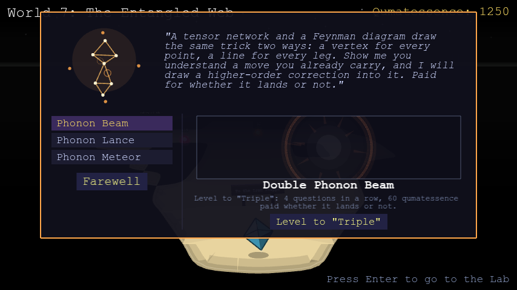

## Kondo's Clouds

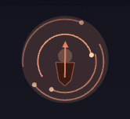

Sells three self-buff moves, cast on yourself rather than the opponent, dealing no
damage:

- **Screening Pulse**: shields you, reducing incoming damage for a few
  turns
- **Scattering Drag**: makes you evasive, giving incoming hits a chance to
  miss entirely
- **Coherence Cascade**: sets you regenerating, healing you a little each
  turn

Picking a move picks the buff. Only one can be active at a time; switching
means talking to Kondo again.

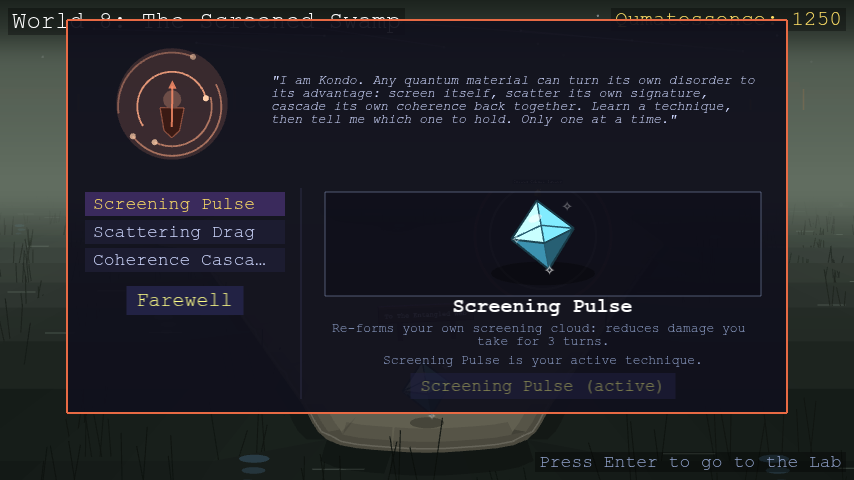

Each of these three can also be leveled up at [Feynman's](#feynmans-diagrammatics),
same as any other move, leveling one makes its buff itself stronger (more
damage reduction, a better dodge chance, more healing per tick), up to a cap
so it never becomes complete immunity.

## Franklin's Scatterings

Teaches three passive abilities, always-on effects for the whole battle,
not moves you pick each turn. You can learn all three, but only one is ever
equipped at a time; talk to Franklin again to switch. Themed around X-ray
diffraction of a defect-riddled or porous crystal, the way a real
diffraction pattern blurs from sharp spots into diffuse rings as a sample
gets more disordered.

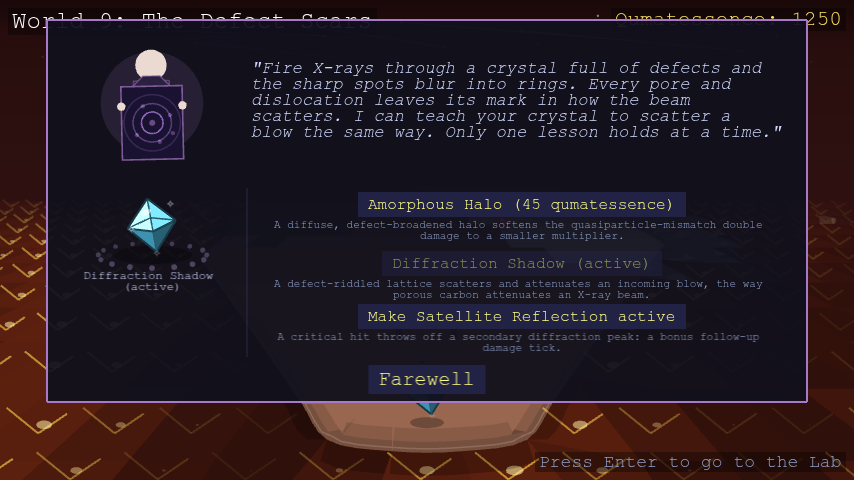

<!-- GENERATED:FRANKLIN_PASSIVES_TABLE START -->
#### Franklin's passives

| Passive | Effect | Cost |
| --- | --- | --- |
| Diffraction Shadow | A defect-riddled lattice scatters and attenuates an incoming blow, the way porous carbon attenuates an X-ray beam. | 40 |
| Satellite Reflection | A critical hit throws off a secondary diffraction peak: a bonus follow-up damage tick. | 45 |
| Amorphous Halo | A diffuse, defect-broadened halo softens the quasiparticle-mismatch double damage to a smaller multiplier. | 45 |
<!-- GENERATED:FRANKLIN_PASSIVES_TABLE END -->

## Skłodowska-Curie's Experiments

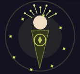

Guards World 10 and is regarded as the leader of the guardians' circle.
Sells two quiz-gated Ultimate moves, "[Quasiparticle] Meteor" and
"[Quasiparticle] Nova", each far more powerful than any ordinary move in
the game, and gated to match: landing one takes three physics questions in a
row, all correct, drawn from a broad pool spanning everything the course has
covered rather than any one world's topic. Miss even one question and the
move whiffs for zero damage, though your turn is still spent.

Picking which quasiparticle an Ultimate move carries isn't a flat purchase
like it is everywhere else: each quasiparticle class costs 1000
qumatessence to unlock *per move*, after which retuning back to that class
is free forever. Land a full 3-for-3 hit and it plays the longest, most
dramatic summoning animation in the game.

