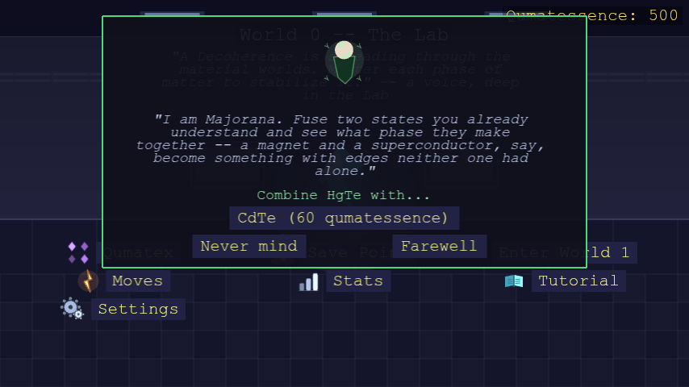

# Hybrid materials

Some crystals in the game aren't a single, un-mixed compound. Majorana
(World 5) lets you fuse two crystals you've already defeated into a new
state, if the pairing matches one of the named recipes below.

Every result is a real crystal, and every one is also found wild in World
10 — worlds 1-9 never spawn one as an ordinary wild encounter — so a hybrid
you fuse and the same hybrid found wild are the exact same crystal.
Dresselhaus's transmute list and Anderson's impurity-host list both skip
every hybrid, since those two mechanics are about one real, standalone
crystal's own physics.

## Fusion recipes (Majorana)

Not every possible pairing works — this is a curated, physically grounded
catalog of named parent pairs, not a generic "these two types always fuse
into that type" rule. If a pairing isn't listed below, it can't be fused —
even if both crystals share the same type.

<!-- GENERATED:RECIPES_TABLE START -->
| Parent A | Parent B | Result |
| --- | --- | --- |
| Aluminum | Indium Arsenide | InAs/Al Majorana Wire |
| Graphene | Graphene | Twisted Bilayer Graphene |
| Chromium Triiodide | Niobium Diselenide | CrI₃/NbSe₂ Topological-SC Heterostructure |
| Chromium | Bi₂Te₃ | Cr-doped (Bi,Sb)₂Te₃ |
| Iron | Lead | Fe/Pb Majorana Chain |
| Chromium Triiodide | Chromium Triiodide | Twisted CrI₃ |
| Monolayer MoTe₂ (2H) | Monolayer MoTe₂ (2H) | Twisted Bilayer MoTe₂ |
| Niobium Diselenide | Chromium Tribromide | NbSe₂/CrBr₃ Topological-SC Heterostructure |
| Tantalum Disulfide (1T) | Tantalum Disulfide (1H) | 1T/1H-TaS₂ Heterostructure |
| HgTe | CdTe | HgTe/CdTe Quantum Well |
| Graphene | Monolayer Boron Nitride | Rhombohedral Pentalayer Graphene/hBN Moiré |
<!-- GENERATED:RECIPES_TABLE END -->

See [Guardians](guardians.md#majoranas-fusion) for how the fuse mechanic
itself works, and [Crystals](crystals.md) for the full per-world material
list.
