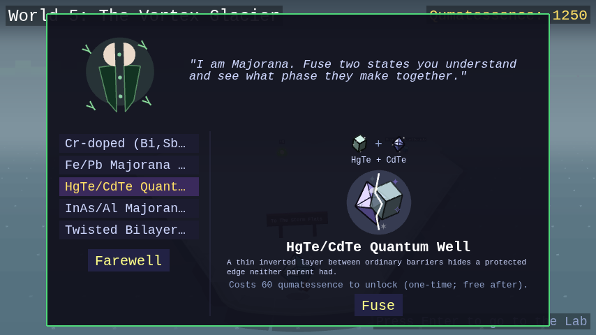

# Hybrid materials

Some crystals in the game aren't a single, un-mixed compound. Majorana
(World 5) lets you fuse two crystals you've already defeated into a new
state, if the pairing matches one of the named recipes below.

Every result is a real crystal, and every one is also found wild in World
10 (worlds 1-9 never spawn one as an ordinary wild encounter), so a hybrid
you fuse and the same hybrid found wild are the exact same crystal.
Dresselhaus's transmute list and Anderson's impurity-host list both skip
every hybrid, since those two mechanics are about one real, standalone
crystal's own physics.

## Hybrid Aura

Every hybrid, whether you fused it or met it wild in World 10, carries a
built-in passive ability, Hybrid Aura: your hits land 30% harder and every
hit you take is softened by 30%, for as long as you wear the hybrid form.
Two phases coupled across one interface lend each other what neither has
alone, which is the whole point of building a heterostructure. It is part
of the crystal rather than something you buy: it takes none of Franklin's
passive slots, can't be set aside, and is listed at the Lab's Abilities
station and on your crystal's pill in battle like any other passive. The
glow a hybrid wears is the aura; there is nothing extra to look for.

The wild hybrids of World 10 carry it too, so they hit harder and hold out
longer than their stats alone say. The Adapted, World 10's rival, never
carries it, even when it reshapes into a hybrid compound: it is a model of
a material, not a fused one.

## Fusion recipes (Majorana)

Not every possible pairing works: this is a curated, physically grounded
catalog of named parent pairs, not a generic "these two types always fuse
into that type" rule. If a pairing isn't listed below, it can't be fused:
even if both crystals share the same type.

<!-- GENERATED:RECIPES_TABLE START -->
| Parent A | Parent B | Result |
| --- | --- | --- |
| Aluminum | Indium Arsenide | InAs/Al Majorana Wire |
| Graphene | Graphene | Twisted Bilayer Graphene |
| Chromium Triiodide | Niobium Diselenide | CrI₃/NbSe₂ Topological-SC Heterostructure |
| Chromium | Bi₂Te₃ | Cr-doped (Bi,Sb)₂Te₃ |
| Iron | Lead | Fe/Pb Majorana Chain |
| Chromium Triiodide | Chromium Triiodide | Twisted CrI₃ |
| Monolayer MoTe₂ (2H) | Monolayer MoTe₂ (2H) | Twisted Bilayer MoTe₂ |
| Niobium Diselenide | Chromium Tribromide | NbSe₂/CrBr₃ Topological-SC Heterostructure |
| Tantalum Disulfide (1T) | Tantalum Disulfide (1H) | 1T/1H-TaS₂ Heterostructure |
| HgTe | CdTe | HgTe/CdTe Quantum Well |
| Graphene | Monolayer Boron Nitride | Rhombohedral Pentalayer Graphene/hBN Moiré |
<!-- GENERATED:RECIPES_TABLE END -->

See [Guardians](guardians.md#majoranas-fusion) for how the fuse mechanic
itself works, and [Crystals](crystals.md) for the full per-world material
list.
