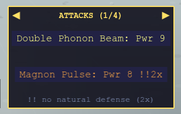

# Quasiparticles & moves

Every move is named after a real quasiparticle or excitation, never a
generic "attack type." A crystal can only ever learn moves its own physics
actually supports: a plain band insulator has no magnetic order, so it
never gets a magnon move. Move power climbs with how exotic the underlying
physics is: an ordinary lattice vibration sits at the bottom, a topological
or non-Abelian excitation at the top.

## Ordinary moves

<!-- GENERATED:MOVES_TABLE START -->
| Move | Quasiparticle | Power | Crystal types that can use it |
| --- | --- | --- | --- |
| Phonon Beam | Phonon | 6 | Every type |
| Electron Pulse | Electron | 7 | Chern Insulator, Chern Superconductor, Fractional Chern Insulator, Kondo Heavy Fermion, Metal, Metallic Magnet, Quantum Spin Hall Insulator, Semiconductor, Superconductor |
| Magnon Wave | Magnon | 8 | Insulating Magnet, Metallic Magnet, Multiferroic |
| Plasmon Resonance | Plasmon | 8 | Metal, Metallic Magnet |
| Ferron Switch | Ferron | 8 | Ferroelectric, Multiferroic |
| Triplon Surge | Triplon | 9 | Quantum Spin Liquid |
| Electromagnon Drive | Electromagnon | 9 | Multiferroic |
| Spinon Swap | Spinon | 10 | Kondo Heavy Fermion, Quantum Spin Liquid |
| Chiral Current | Chiral | 10 | Chern Insulator, Chern Superconductor |
| Helical Lock | Helical | 10 | Quantum Spin Hall Insulator |
| Higgs Oscillation | Higgs | 10 | Chern Superconductor, Superconductor |
| Heavy Fermion Drag | Heavy Fermion | 10 | Kondo Heavy Fermion |
| Vison Loop | Vison | 10 | Quantum Spin Liquid |
| Anyon Braid | Anyon | 11 | Fractional Chern Insulator |
| Majorana Split | Majorana | 11 | Chern Superconductor |
<!-- GENERATED:MOVES_TABLE END -->

## Which crystal types can host which quasiparticles

This is the game's only type-interaction rule: if the defender's own type
can't host the attacking move's quasiparticle class at all, the hit lands at
**double damage**. That's it: no separate strong/weak chart stacked on top
of it.

<!-- GENERATED:COMPATIBILITY_TABLE START -->
| Crystal type | Quasiparticles it can host |
| --- | --- |
| Chern Insulator | Chiral, Electron, Phonon |
| Chern Superconductor | Chiral, Electron, Higgs, Majorana, Phonon |
| Ferroelectric | Ferron, Phonon |
| Fractional Chern Insulator | Anyon, Electron, Phonon |
| Insulating Magnet | Magnon, Phonon |
| Insulator | Phonon |
| Kondo Heavy Fermion | Electron, Heavy Fermion, Phonon, Spinon |
| Metal | Electron, Phonon, Plasmon |
| Metallic Magnet | Electron, Magnon, Phonon, Plasmon |
| Multiferroic | Electromagnon, Ferron, Magnon, Phonon |
| Quantum Spin Hall Insulator | Electron, Helical, Phonon |
| Quantum Spin Liquid | Phonon, Spinon, Triplon, Vison |
| Semiconductor | Electron, Phonon |
| Superconductor | Electron, Higgs, Phonon |
<!-- GENERATED:COMPATIBILITY_TABLE END -->

World 1 goes easy on you while you are starting out. As long as your Energy,
Momentum and Lifetime are all still below 5, every opponent there, the wild
crystals and the world's rival alike, attacks only with Phonon Beam. Every
crystal type hosts phonons, so nothing World 1 throws at you can land at double
damage, which makes it a safe place to learn the rule before it starts cutting
both ways. Once any one of your three stats reaches 5, World 1 fights with its
full moveset too, and from World 2 on opponents always do.

## Landau's Analytic moves

Landau (World 4) sells two moves that aren't in the table above, since
they're quiz-gated separately: a lance and an eruption. Using either one asks
a physics-equation question first: answer right and it hits for double
damage, answer wrong and it's halved.

Landau's shop also lets you tune each move to any quasiparticle class your
*current* form can host, the same choice an ordinary move's fixed class
already makes for you. Each move's name always reads "<quasiparticle>
Lance"/"<quasiparticle> Eruption," defaulting to Phonon Lance/Phonon Eruption
until tuned, so they're always usable. See
[Guardians](guardians.md#landaus-formulas) for how the shop and tuning
picker work.

## Skłodowska-Curie's Ultimate moves

Skłodowska-Curie (World 10) sells two more moves outside the table above: a
meteor and a nova. Each is far more powerful than any ordinary move (power
100, ten times an Analytic move's) and gated to match: landing one takes
three physics questions in a row, all correct, drawn from a broad pool
spanning the whole course rather than one world's topic. Miss even one
question and the move whiffs for zero damage, though the turn is still
spent.

Like Landau's Analytic moves, each one can be tuned to any quasiparticle
class your *current* form can host, and always reads "<quasiparticle>
Meteor"/"<quasiparticle> Nova." Tuning isn't a flat purchase here, though:
each quasiparticle class costs 1000 qumatessence to unlock per move, the
first time you pick it, after that, retuning back to it is free forever.
See [Guardians](guardians.md#skłodowska-curies-experiments) for how the shop
and per-class pricing work.

## Kondo's self-buffs

Kondo's three moves sit outside the roster above entirely: they're
self-buffs, not attacks. They deal no damage and never trigger the
quasiparticle-mismatch rule, so there's no compatibility list to check.
Casting one wraps you in a screening cloud for 3 turns instead of hitting the
opponent, and what a cloud screens is a quantum number: spin, charge, or the
order parameter of a broken symmetry. An incoming attack whose quasiparticle
carries that quantum number lands for half damage, and every other attack
lands in full. Only one can be active at a time. See
[Guardians](guardians.md#kondos-clouds) for the list of which quasiparticles
each cloud screens.

See [Crystals](crystals.md) for which crystal types appear in which world.
