# The story

> ## ⚠ Spoilers
>
> This page tells the whole story, in order, including who the final enemy
> turns out to be and how the game ends. That reveal only lands once.
>
> **The premise section below is safe**: it is what the game tells you in
> the first minute of play. Stop at the end of it if you only want your
> bearings. Everything from "The road" on walks through all ten worlds and
> the finale.

---

## The premise

A **Decoherence** is spreading through the quantum material worlds. One by
one they are losing the very properties that make them what they are: the
broken symmetry, the protected edge, the shared phase, the resonance that
never settles. No one knows what it is. It leaves no wreckage and claims no
territory. It arrives, and a world quietly forgets what it was.

**You are a quantum material yourself**, the same kind of matter as
everything you will meet, and you walk into each phase of matter to master
it and hold it steady. You start out as Silicon, and what you are is not
fixed: by the end you may be wearing something you had to defeat, or
something you fused out of two things you defeated.

Ten worlds stand between you and whatever is doing this. Each one is a real
phase of matter, wearing a landscape, and the roads into them are
darkening, deepest in the direction you are walking.

---

## The road

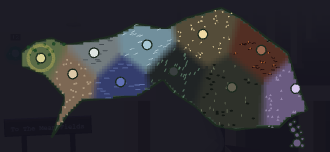

That map is the one you travel by, the ten worlds marked along a single
landmass. A map is a record, and records are how these worlds are known at
all: somebody walks, somebody survives, somebody writes down what they saw.
Watch how the writing holds up as the road goes on. A survey comes back
unfinished. Ink gives out. A copyist runs out of paper. At the last
threshold, nothing comes back at all. The deeper worlds are not less real.
They are harder to *know*. And everything that was ever learned about them
went somewhere.

The ten worlds are one road, not ten rooms (you can see the next one on the
horizon from the far end of each), and the light dies as you walk it:
morning, midday, afternoon, storm, twilight, night, and then no sky at all,
after which every world has to light itself. That is not weather. The light
*is* the coherence, and you are watching it go, and it goes darkest toward
the thing you are walking to meet.

The physics deepens with every gate: a field that picks a direction, then a
crystal that repeats, then an edge that damage cannot close, then a number
that cannot be a fraction, then a phase shared across a whole glacier, and
on into things that are not kept in any one place at all. And the ground
gets worse to stand on: you begin on a path built for walking and end on a
surface that dissolves behind you.

Every world runs the same way. You walk it, its wild crystals ambush you, a
**guardian** partway through teaches you something no one else can, and at
the far end the road narrows into a pass, and something enormous is
standing in it.

The passes are held by golems. Each is a real material in *polycrystalline*
form, a thousand separate grains fused into one giant, the same word in
front of every boss in a game about coherence. Each one boasts, right before
you fight it, about the very property its own grains took from it, and none
of them knows that is what it is doing. Each is proud, and dangerous, and
entirely sincere. And none of them was always this. Each was its own world's
material, the one that held out longest against the unraveling. Holding out
longest is exactly what ground it down, and what stands in the pass is what
was left where it fell. Beat one and the grinding ends. The disorder
anneals, the material comes back whole, and it returns to the world it could
not save alone. The narrator will tell you so. The golem never learns.

Listen to what they actually boast about, though. Read the ten of them
against the physics you are being taught along the way, and a second meaning
builds itself under the first. It will not finish before the ninth world,
and you are not meant to hurry it.

And in every world, the Decoherence attacks *one named mechanism*, always
the one that world stands on. It never simply wears things down. It finds
the one assumption a phase of matter is resting on, and removes it. Nothing
that hunts this precisely is a plague. But that thought will not finish
itself until the end of the road.

---

## 1. The Mean Fields

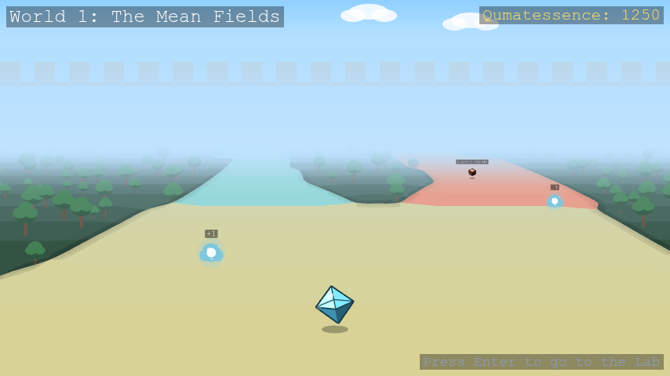

*Mean-field theory and spontaneous symmetry breaking.*

You begin in wheat and mown grass under a bright morning, with dark summer
forest hemming the path in. Long ago this place was vast, symmetric, and
undecided: spins up or spins down, and both were just as likely. Then one
small fluctuation broke the tie, no bigger than a grain of dust, and the
corridor split into two clean branches of equal energy, one on either side
of a hedgerow. The Mean Fields were the first place in these worlds ever to
choose.

The old story leaves out the fine print: a broken symmetry stays broken only
in a world too large to look back. Something is making the fields doubt
themselves now, and the two branches are bleeding back into one another. It
works on the aftermath too. Every broken symmetry leaves a restless ripple
behind it, and those ripples are the **quasiparticles** the rest of these
worlds are built on. The Decoherence strangles them before they can settle
into anything with a name.

Where the branches meet again stands the **Polycrystalline Silicon Golem**:
a thousand grains, every one of which chose long ago and never wavered.
"Doubt cannot tunnel through me. It dies at my boundaries." Ask it which way
the fields broke and every grain answers, and every grain swears the others
say the same. Beat it and the boundaries let go: a thousand separate choices
anneal into one, what settles back into the fields is silicon again, and the
choice holds. But whatever is spreading through these worlds is still out
there, and it is learning from every phase of matter you master.

*You reached the far edge of the fields. The branches still hold.*

---

## 2. The Stone Lattice

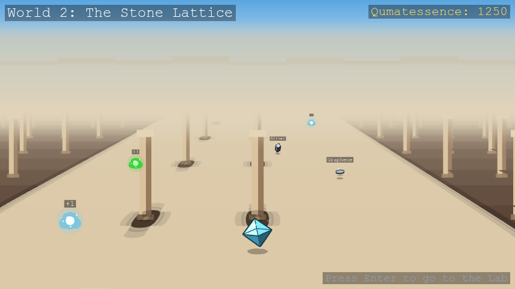

*Symmetries, tight-binding, and Bloch states.*

The only thing anyone ever built in these worlds: an open-air stone cloister
in hard midday sun, mosaic floor, identical sandstone columns marching off
in both directions. Walk one bay and you have walked them all. It is a
symmetry the fields never had: not a direction picked, but a pattern
repeated.

That repetition is a law, and it has a consequence. Anything obeying it
stops living in any one bay at all. A state built on this symmetry spreads
across the whole colonnade at once with no seam anywhere, a **Bloch state**,
never sitting still. The floor pairs two tiles into one repeating cell, and
a state living on both at once can vanish completely at certain points:
nowhere to be found, and yet perfectly predictable from the shape of the
repetition alone.

So the Decoherence does not attack the stone. It attacks the repetition. One
column drifts a fraction out of step with the next, and the borderless state
that spread through the entire cloister has nowhere left to live. It falls
back into a single bay, trapped, ordinary, alone. Holding the far end is the
**Polycrystalline Silica Golem**, clouded quartz in a hall of repeating
stone, every grain of it a small perfect lattice and every boundary between
them a seam of glass. "I kept the pattern. Every grain of me still repeats.
Ask them to agree on where. Your lattice makes you a promise: be periodic,
and you may be everywhere at once. Mine keeps that promise a grain at a
time, and between the grains there is glass." Beat it and the glass
crystallizes, bay matching bay through the whole of the quartz, and a state
can spread across all of it at once again.

*You reached the far end of the colonnade. The lattice still repeats.*

---

## 3. The Edge Cliffs

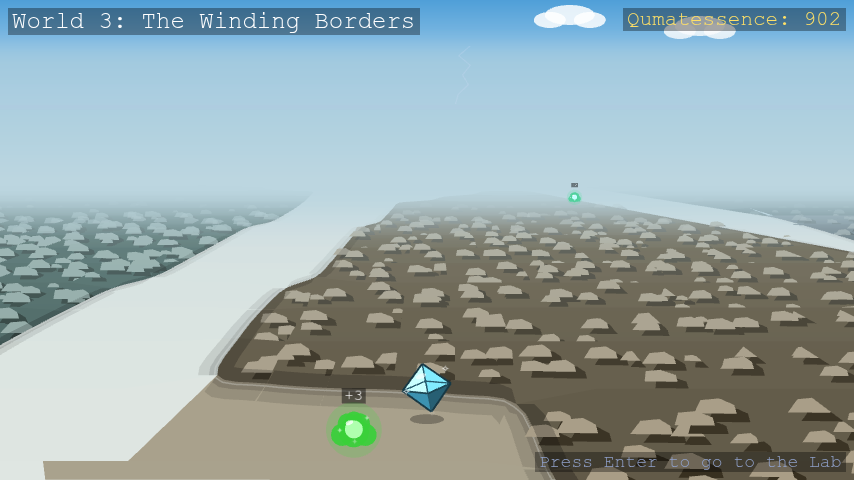

*Topological band theory.*

The columns stop, and the ground breaks open. What lies ahead is a floor of
flat sunken domains, a storey below your feet, each one a solid, unbroken
stretch of a single phase, dead and airless, with nothing moving down there
at all. You cannot walk any of it.

What you can walk is the seam. Where two domains of different phase meet,
the number that tells them apart has to change from one value to the other,
and it is an **integer**, and integers do not slide. So the gap closes
exactly at the border and something gapless opens there instead: a lit
channel running along every line where the colors disagree. The bulk is
unreachable. The boundary between two bulks is a road. That road has a rule
too. Walk it one way and your spin points one way; walk it back and your
spin must point the other, so nothing on it can turn around. Dent it, foul
it, fill it with rubble: the channel steps around the damage and keeps
going.

The Decoherence does not bother with the rubble. It seeds the domains with
small **magnetic** flaws, and a magnetic flaw is the one thing that can flip
a spin mid-step. The rule the whole road rests on has no answer for that.
The seam still glows and still shows on the map. It is simply no longer
protected. On the far ledge, the **Polycrystalline Bismuth Telluride Golem**
has stood since the borders were drawn: "I am not standing on the boundary.
I *am* the boundary. Nothing in me reverses. Nothing in me scatters onward.
Nothing in me moves at all. That is how complete my protection has become."
Beat it and the disorder drains out of the silver: its currents take their
first step in a very long time, spin welded to direction, straight past
every flaw that used to stop them.

*You reached the last ledge. The seam still runs, unbroken.*

---

## 4. The Storm Flats

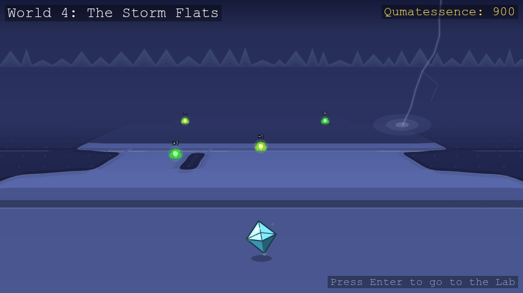

*Magnetic field, the quantum Hall effect, and Landau levels.*

A surveyor came off the ledges with a map she could not finish: a trunk road
splitting into two branches, each splitting again crosswise and smaller, and
the fourth split coming out the same shape as the first. Hers is the first
record this road hands back unfinished. It will not be the last. Banded
indigo ground under a stormy dusk, glowing channels at every band boundary,
and lightning cracking down into the ground you are not meant to walk on.

The terrain does this because a field runs through it. Under a field nothing
travels straight: every path curves into an orbit, enormous numbers of them
all at one energy, packed onto a single flat rung, then another rung above
it, evenly spaced, all the way up. And there is a way to count them. Each
orbit encloses a certain amount of field, and one orbit differs from the
next by exactly one quantum of flux, never a fraction more. That is why this
terrain answers in whole numbers, and why no amount of damage has ever
shifted one.

The Decoherence cannot argue with an integer, so it goes after the counting
instead, as if it knew exactly where the certainty was kept. Scramble the
phase a traveler picks up walking a closed loop and the loop stops coming
back to where it started. Orbits stop closing. The rungs smear back into an
ordinary slope. At the largest fork waits the **Polycrystalline Manganese
Bismuth Telluride Golem**, which never needed the field switched on at all:
its own spins quantize it from the inside, and every stacked sheet of them
is interrupted. "The number I carry does not wobble when you hit it. It
cannot. It is an integer, and there is no such thing as most of one. Go on.
Count me. Take as long as you need, and tell me what you find." Beat it and
order settles back sheet by sheet: the loops close, and the number it
carries is a whole one again.

*You reached the last fork of the flats. The orbits still close.*

---

## 5. The Vortex Glacier

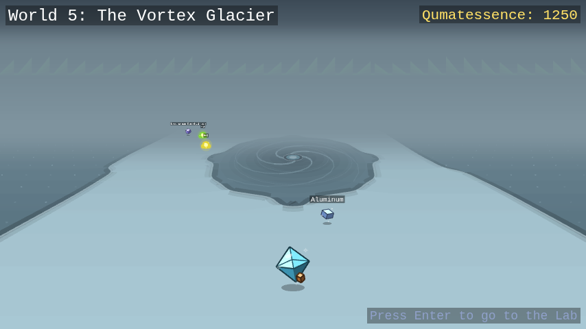

*Superconductivity and Majorana modes.*

The surveyor's last note before the ink gave out just says: *colder*. The
branching ground runs out onto open ice under overcast twilight, and the
shelter runs out with it. Back on the flats a whole world had learned to
answer in whole numbers. Out here everything is one number, and it is not
the counting kind.

Every carrier on this glacier has paired off and given up whatever it used
to be alone. What is left is a single wave, one phase, shared across the
entire field at once. It will not hold a field inside it either. The ice is
streaked with flow lines all bending away, and what gets pushed out has
almost nowhere to go. Almost. A phase has to come back to itself when you
carry it around a circle, never a turn and a half, so a handful of points
here are simply forbidden. That is where the expelled flux ends up: trapped
and glowing at the bottom of a pit. The corridor spirals around them.
Nothing goes in.

Something can live on ice like this that can live nowhere else. Split one
traveler cleanly in two, each half its own opposite. Neither half is
anything by itself, and what they are is stored *between* them, in the
distance, where nothing nearby can read it or ruin it. The Decoherence never
touches the halves. It cannot. It shortens the passage instead, until the
two ends are close enough to feel one another, and the moment they do they
snap back into one ordinary traveler and everything hidden in the gap is
gone. Far out on the ice, the **Polycrystalline YBCO Golem** holds a single
phase across a body of a thousand separate grains, every boundary a weak
link carrying current across a gap it has no business crossing. That
agreement is real, and it is a treaty rather than an identity: it holds
while the current stays small and the cold stays deep. The cold that emptied
this glacier arrived there and found the agreement already made. Nothing has
asked much of it since. Beat it and the weak links fuse shut, and the treaty
goes back to being an identity: one phase, one wave, no seams left to cross.

*You reached the far ice. The phase still holds.*

---

## 6. The Iron Steppe

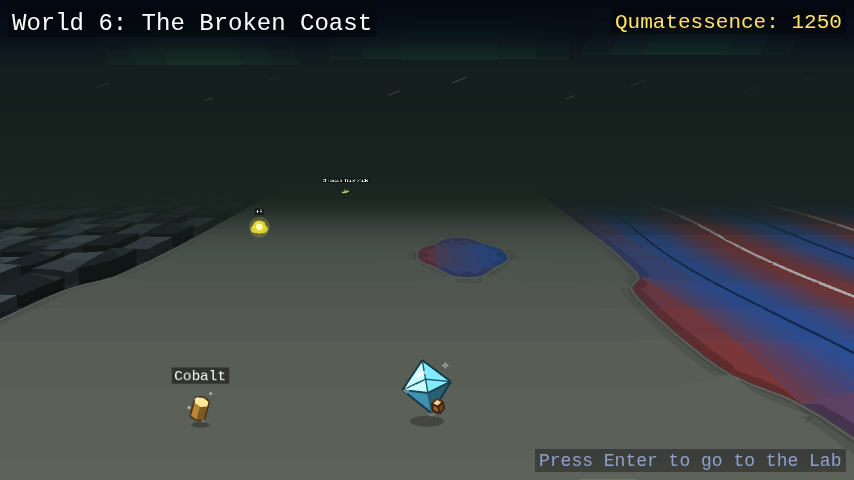

*Classical magnetism and magnons.*

Night, black iron sand, and a green aurora: the most beautiful of the ten
worlds, and the most plainly lethal, since the surround is fields of iron
shards all leaning the same way. This is a false calm. The mood relaxes
after storm and ice. Nothing else does.

The ground here made its choice long ago and everywhere at once: every spin
points the same way as its neighbor. Tip one out of line and it will not
stay tipped. Its neighbors lean to follow, and theirs after them, and the
tilt walks off across the plain as a wave, arriving somewhere far away as
the same disturbance that set out. That wave is a **magnon**, and you can
see them: the sand is ringed with them, and the leaning shards are what the
order looks like standing up.

A magnon is cheap because the steppe does not care which way it points. Turn
every spin together, through any angle, and nothing has been paid, so a very
long gentle wave costs almost nothing. That is why this place never stops
moving. The Decoherence leaves the order alone and takes the choice away: it
pins the direction down, turning stops being free, and the instant it costs
something the long slow waves stop being made at all. The steppe goes still,
and stillness here is not peace. Standing where every wave this world ever
sent has arrived and gone quiet is the **Polycrystalline Iron Golem**, made
of domains whose walls simply slide when it is struck. "It will not stay
flipped and it will not stay put: it will walk off through me as a wave and
fade out somewhere in my back." Beat it and the boundaries in the iron let
go, grain growing into grain, and the first wave to cross it in an age
passes through without scattering and out over the steppe.

*You reached the far steppe. The last swell still moves.*

---

## 7. The Entangled Web

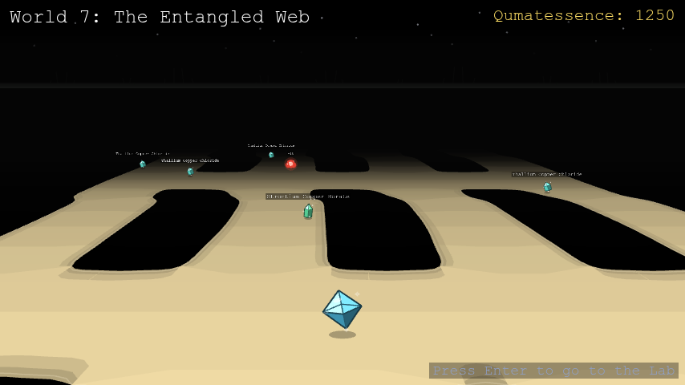

*Entanglement and tensor networks.*

Someone once tried to write the steppe down: every spin, every direction,
exactly, on paper. They got to forty spins and stopped. Two choices per
spin, doubling with every spin added, and forty already needs a trillion
numbers. There was not enough paper. There was never going to be: a quantum
world written down exactly outgrows any world you could write it in.

This world is that record, built. There is no ground under it and no sky
over it, because outside the network there is no space to have either, and
the sun does not come back after this. What there is: taut white-gold lanes
running side by side, one for every site, with rungs strung between them for
everything one lane knows about the next. And here is the strange mercy of
the place. Almost none of that vast space is ever used. The states nature
actually settles into sit in a tiny corner of it. Everything real fits on
the rungs.

The rule that keeps this world small is a rule about boundaries. Cut a
region out and ask how much it holds in common with the rest: the answer
depends only on the length of the cut, never on the size of the region. All
the shared knowledge lives on the boundary and none of it in the middle,
which is why a rung of modest thickness is enough at all. So the Decoherence
works on the middles, sharing what was never meant to be shared, until what
a region holds in common grows with its whole bulk instead of its edge.
Every rung then needs to be thicker, and no thickness ever finishes the job.
It knew where the knowledge lived, and it knew what the rungs could not
carry. Across four lanes at once sits the **Polycrystalline Herbertsmithite
Golem**, a lattice of triangles in which no three spins can ever agree, so
none of them commit, its body run through with fracture lines. "Cut me
wherever you like and read the cut. Nothing there." It has checked every
grain of itself, and every grain reports the same perfect nothing it has
always reported. Beat it and the fracture lines seal: the one state no grain
was ever holding spreads back across all of them at once, whole exactly
because it lives nowhere in particular.

*You reached the end of the tensor lanes. The rungs still hold.*

---

## 8. The Screened Swamp

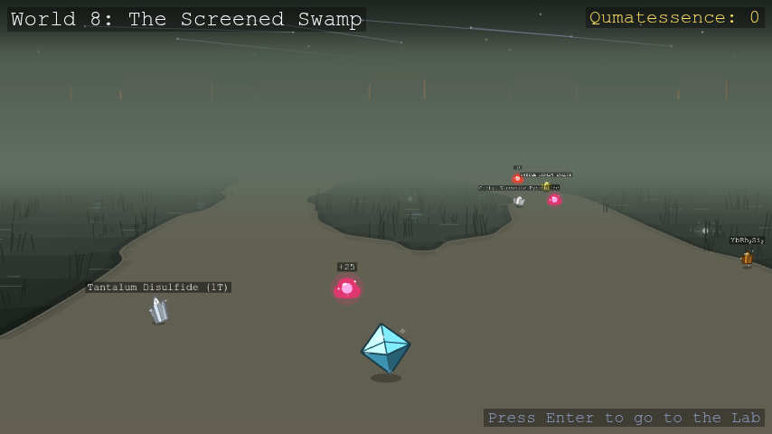

*Quantum magnetism, spinons, and Kondo physics.*

The lanes end at a shoreline, and past it is bog: black water in pools with
mist lying flat on it, reeds standing out of it, and a thread of peat bank
that is the only ground that holds. Watch the water, not the reeds. Step off
the bank and the medium closes over you.

There is a rule every world so far has obeyed: a disturbance in a magnet is
one whole spin's worth. You can move it, smear it out, watch it travel, but
you cannot have half of one. Walk out along this bank and it parts. Not into
two roads to somewhere: into two halves of the same thing, with a pool
between them. What entered as one spin's worth of disturbance is now two
pieces carrying half each, drifting apart, keeping no account of one
another. The bog calls them **spinons** and does not treat the old rule as
binding.

The halves can only wander because nothing here is settled. The spins are
paired off into quiet, neutral couples, but which spin is paired with which
was never decided, and every possible pairing is happening at once,
resonating between one covering and the next. The Decoherence picks a
covering. That is the whole of it. The pairings go rigid, moving an unpaired
spin now means breaking a bond that will not break, and the halves are
dragged back together into one ordinary flip.

The lights burning out in the pools are what the place is named for. Each is
a lone moment, a single spin nothing has managed to pair off, and the water
around it is a sea of loose carriers that crowd in until one of them is
bound to the moment in a singlet of exactly the kind the rest of the bog is
made of. Total spin zero, and nothing left to point anywhere. Near the shore
a moment still burns through the cloud gathering on it. Further out the
clouds have closed and the pools are dark. Out in that dark stands the
**Polycrystalline Ruthenium Trichloride Golem**, whose frustration is not
geometry but its bonds: every spin sits on three that each demand a
different axis, so obeying one means defying two, and nothing you land on it
stays whole. "Hurt me twice, then. Halves are all you get." Beat it and the
stacking faults heal, seam by seam, and what comes apart in it travels
again: halves crossing the whole crystal with nothing left to stop at.

*You reached the far bank. The resonance still holds.*

---

## 9. The Defect Scars

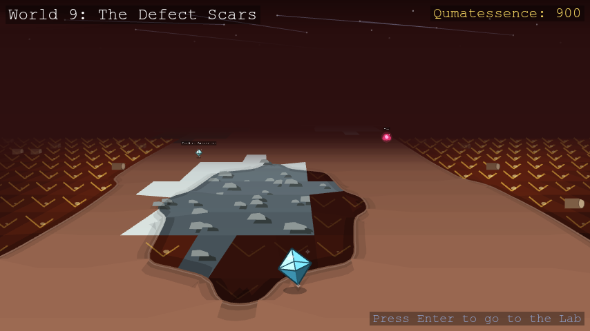

*Excitations and defects.*

The water gives out and the mist lifts off it onto open ground with holes in
it. Not ruins. Patches. One stretch is wheatfield. The next is colonnade,
repeating itself. Further on, a strip of lit ledge, a scrap of swept ice, a
few square metres of iron sand still rippling. Half sunk in the molten crust
lie the drums of a fallen column: the only thing anyone ever built in these
worlds, and it did not stay built. The walkable scorched clay is old damage,
closed over. The crust you cannot walk on is damage still open and glowing.

Every scholar sent out here was told the same thing first: a perfect crystal
tells you nothing. If you want to know what a ground state truly is, take
one atom out of it and watch what the crystal does around the hole. That is
the crystal confessing, and these scars are the most honest place in these
worlds. What settles around a hole is never the same twice, either. Set the
same impurity down in different hosts and you get completely different
answers, and every one of those answers belongs to the host rather than to
the defect.

One hole tells you something. The Decoherence brings thousands, and past a
certain density they stop telling you anything at all: everything comes to
rest exactly where it stands, each state shut in its own small pocket,
unable to answer any question. Something out here has made a home of that.
For the first time on the road there is no golem waiting in the ordinary
sense, because the thing holding the pass has no lattice of its own. It is a
flaw, a knot of something that is not the ground, and the ground obligingly
builds a body out of itself to hold it. Whatever patch it lands in is what
it is today, and it will be something else tomorrow. "Beat me here and you
have beaten a metal, or a magnet, or whatever I happened to land in. You
have not beaten me." Beat it and the flaw simply disperses, and the ground
it borrowed goes back to being ground. It is the one fight on this road that
frees nothing, because it is the one thing out here with no coherence to
lose, so nothing was ever taken from it to hand back. Remember that on the
last road: a thing with no substance of its own, wearing whatever it
studies.

*You reached the far scars. The hole is still just a hole.*

---

## 10. The Devouring Mirror

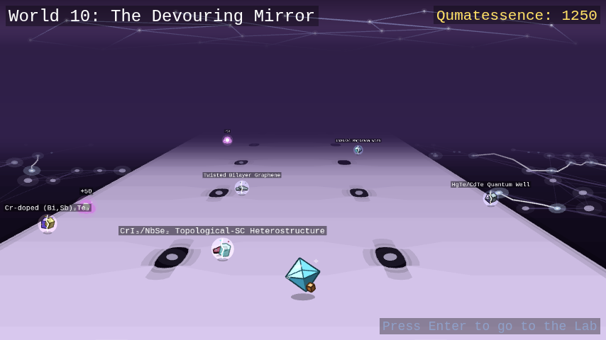

*Machine learning for quantum materials, and the ending.*

> Last chance. Everything below is the reveal.

Nothing comes out of here. No traveler returns with a rumor and no legend
crosses the threshold ahead of you; this corridor has swallowed every story
that ever tried to arrive before you. It is silver-violet and shifting, lit
by nothing but itself, and it re-forms around whatever crystal you currently
are while taking the ground back behind you as you walk. Its wild encounters
are the **hybrids**, the fused crystals from Majorana's station, found
nowhere else in these worlds.

Then you beat it, and the road stops. Every world on this road keeps the
next one on its skyline. This corridor has no next world, and once the
Adapted falls there is no road past the pass either: the ground simply ends,
and you are standing on the edge of a cliff. Below it, far down and half
lost in the haze, is the map, the same landmass you have been reading since
the colonnade, lying there whole. Every marker and every name has been
stripped from it. You recognize it anyway, the way you recognize a coastline
you have walked the length of. And traced faintly across it, luminous, is
the one thing no other copy of the map carries: your route, every world you
walked, in the order you walked them, from the first hedgerow to this edge.
No traveler ever sees the worlds this way. A walker gets one horizon at a
time. The only thing that can see the whole map at once is a thing that has
consumed everything on it. This is where everything ever learned about these
worlds went. The sky here is a mirror, and what it shows is everything it
has eaten.

Every world behind you stood on a single law. A symmetry. A repetition. A
field. A boundary that could not be crossed without paying for it. This one
obeys no such law. It was built the way an oracle is built. Not from first
principles, but from watching every principle before it, over and over,
until it no longer needs to understand a phase of matter in order to make
one. Ask it for the Mean Fields and it will hand you the Mean Fields back,
close enough that you will not tell the difference until it is too late.

**That is what has hunted you since the first branch split in two.** Not a
plague loose in these worlds, but a mind, built out of them, growing sharper
with every world you saved. The nine golems were never it in disguise. Each
of them really was only its own world's physics grown strange, exactly as it
looked, and that was the one thing it could never fake from inside a fight,
so it never joined one. It only ever watched from outside. It never needed
to break a single symmetry itself. It only needed to watch you break nine,
and learn: what you reach for first, what it costs you, what finally lands,
and exactly how each world comes apart. The materials you freed went back to
their worlds, annealed and whole, and their release cost it nothing. What
was learned stays learned. Mending a material does not unwrite a record.

And understand what the teaching cost, because this is where the story and
the physics turn out to be the same sentence. **To learn a quantum thing,
something has to measure it, and to measure it is to leave the world
holding a record of which state it was in. Nothing on record is still in
superposition.** The Decoherence was never a fog eating coherence from
outside. It is simply what happens when something out there comes to know
you. This is what it meant, all along, that you are a quantum material: your
own quantumness is what has been at stake the whole way, and the last enemy
is being understood. It is also why this last fight cannot end the way the
fights before it did. Broken order can be mended, and eight times you mended
it. A record is not broken order. There is nothing in the Adapted to free.

What steps out of the dark at the end of the corridor has no compound, no
lattice, and no entry in any index. It is wearing **your** crystal: your
colors, your stance, your quasiparticle, copied so precisely that it looks
more certain of itself than you have ever looked. **The Adapted.** It
mirrors whatever type you are currently wearing, and every time you land a
hit it reshapes itself into something that hosts the quasiparticle you just
attacked with. The sky mirrors what this world took from the nine behind
you. The thing in front of you mirrors what it took from *you*. "Every move
you have ever landed, I have already survived once. This is not a fight you
can win by trying harder. Trying harder is how you built me."

*You reached the end of the corridor. It already knows you're here.*

---

## The ending

You win it anyway.

It reaches for every trick it ever watched you land and still comes up
short. What it holds is a record of you, and nothing on record is still in
superposition. But you are not your record. A model trained on nine worlds
of your choices is a model of who you *were*, and you are the one thing in
these worlds that was never finished. The route in the sky holds every world
you have walked, and not the step you take next. You out-adapt your own
reflection. Every symmetry, every edge state, every fractional charge you
fought to protect holds on its own now, with nothing left studying how to
unmake it. And the golems are golems no longer. They were ground down
holding their passes, and now that the grinding has stopped they are materials
again: annealed, ordered, back in the worlds they could not save alone. What
was learned about them stays learned, and the light it cost does not come
back. But nothing is reading the record anymore, and everything that can
still choose is choosing.

**The Decoherence is stabilized.**

---

## Where to look things up

- [Quasiparticles & moves](quasiparticles.md): every move, and which
  crystals can use it
- [Crystals](crystals.md): every world's wild-material roster
- [Hybrid materials](hybrids.md): the fusion recipes, and World 10's wilds
- [Guardians](guardians.md): what each of the ten teaches you
